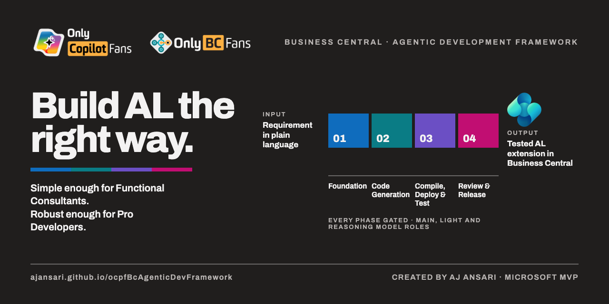

# OCPF BC Agentic Development Framework

**The OnlyCopilotFans Business Central Agentic Development Framework**

Simple Enough for Functional Consultants. Robust Enough for Pro Developers.
*by AJ Ansari*

*Last Updated: Saturday, September 12, 2026*

## Background

This Agentic Development Framework was created to help Business Central Functional Consultants use AI to build AL extensions and apps the **right** way — though professional AL developers will find it just as useful.

The framework incorporates the AL MCP Server, BC Base App documentation from Microsoft Learn, and BCQuality, grounding the agent's guidance in official references and quality tooling rather than AI guesswork alone.

## Contents

| File | Purpose |
|---|---|
| `The OCPF BC Agentic Dev Framework Outline.md` | A raw outline of the framework's Stages and Steps. Start here for a high-level understanding of how the framework is organized. |
| `BC_App_Build_Routine_Agent.md` | The agent instructions file to drop into any new AL project in Visual Studio Code. Review and adapt it as needed, then kick off the process with the prompt below. |

**Getting started prompt:**
> This AL project will follow the Agentic Development Framework outlined in "BC_App_Build_Routine_Agent.md". Please review this file and let's get started.

### Setup by Tooling

Choose the setup that matches your development environment. Both paths use the same source file — only the filename and location change so each tool knows where to look for it.

**Claude Code plugin (Visual Studio Code)**
1. Copy `BC_App_Build_Routine_Agent.md` into your project's root folder.
2. Rename the copy to `CLAUDE.md`.
3. Open the project in VS Code with the Claude Code plugin active — it will automatically load `CLAUDE.md` as project instructions.

**GitHub Copilot Chat (Visual Studio Code)**
1. Create a `.github` subfolder in your project's root folder, if one doesn't already exist.
2. Copy `BC_App_Build_Routine_Agent.md` into that `.github` subfolder.
3. Rename the copy to `copilot-instructions.md`.
4. Copilot Chat will automatically pick up `copilot-instructions.md` for the workspace.

> 💡 **Tip:** Keep the original `BC_App_Build_Routine_Agent.md` in place as your master copy, and create renamed copies for whichever tool(s) you use — that way you can update one framework source and re-propagate changes as needed.

## Roadmap

- ~~Add support for AL MCP~~ ✅ Completed
- ~~Add support for BCQuality~~ ✅ Completed

All previously planned roadmap items have been addressed. New items will be listed here as they're identified.
