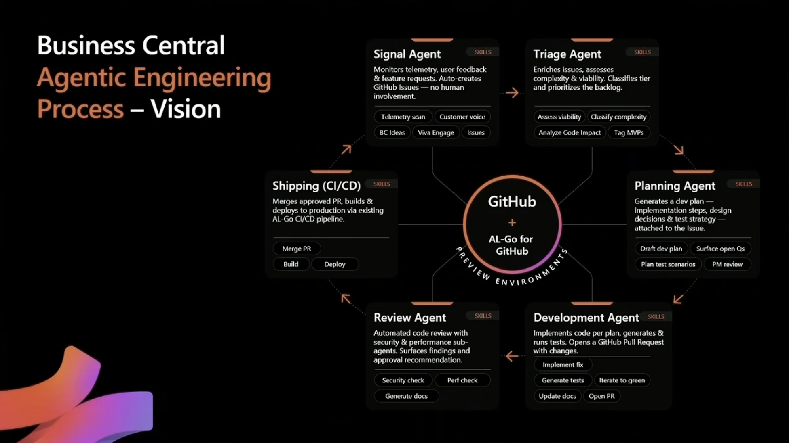

# OCPF BC Agentic Development Framework

**The OnlyCopilotFans Business Central Agentic Development Framework**

Simple Enough for Functional Consultants. Robust Enough for Pro Developers.  

*by AJ Ansari*

*Last Updated: Friday, September 18, 2026*

> ## 🌐 [Official Website](https://ajansari.github.io/ocpfBcAgenticDevFramework/)
>
> **<https://ajansari.github.io/ocpfBcAgenticDevFramework/>**
>
> What the framework is, how it works, and what it produces. **Start here if you're new** — then
> come back for setup.

## Table of Contents

- [Background](#background)
- [Setup: Agent Plugin (Recommended)](#setup-plugin)
- [Staying Up to Date](#staying-up-to-date)
- [Setup: Full Framework (Manual)](#setup-full)
- [Setup: Lite Edition (Manual)](#lite-edition)
- [Roadmap](#roadmap)
- [Repo Contents](#contents)
- [Project Inspiration](#inspiration)

<a id="background"></a>
<details open>
<summary><h1>Background</h1></summary>

This Agentic Development Framework was created to help Business Central Functional Consultants use AI to build AL extensions and apps the **right** way — though professional AL developers will find it just as useful.

The framework incorporates the AL MCP Server, BC Base App and System App documentation from Microsoft Learn, Microsoft's AL Guidelines, and BCQuality, grounding the agent's guidance in official references and quality tooling rather than AI guesswork alone. Alongside the runbook sits my **OCPF AL Development Standards Guide** — the detailed AL rules the routine applies at each step — which the agent fetches into your project automatically.

Both editions are multilanguage from the ground up. Captions and messages use XLIFF translation files, never `CaptionML`. Regional terminology comes from Microsoft's own Business Central translations. The agent drafts translations, a named human approves them, and UAT runs in every required language. You can also work with the agent in your own language. See [Multilanguage Support](translationAndMultiLanguage/MultilanguageSupportOverview.md).

It comes in two editions: the **full framework** (14 steps) for substantial projects, and **[Lite](#lite-edition)** (7 steps) for smaller ones that need to move fast. Both apply the same AL standards.

</details>

<a id="setup-plugin"></a>
<details open>
<summary><h1>Setup: Agent Plugin (Recommended)</h1></summary>

> ### Two steps. Install once, then one command per project.
>
> | | |
> |---|---|
> | **1. Install the plugin** | Once per machine. Pick **one** row from the table below. |
> | **2. Start your project** | Open your AL folder and run `/ocpf-bc:start`. |

That's it. From there the plugin **helps you choose Full or Lite**, **installs the latest runbook**,
**connects Microsoft's AL tools** with nothing to install, **adds sub-agents** for the full
framework's Reasoning and Light roles, and **checks for updates** each session before changing
anything.

*Prefer to do it by hand? The [manual setup](#setup-full) still works exactly as before.*

## Step 1 — Install

**You only need ONE of these.** You build Business Central extensions in **Visual Studio Code** with
the **AL Language** extension, so the two starred rows are the recommended paths.

| Your tool | How to install |
|---|---|
| ⭐ **Claude Code in VS Code** | `/plugins` → **Marketplaces** → add `ajansari/ocpfBcAgenticDevFramework` → **Plugins** tab → **ocpf-bc** → **Install** (choose **User** scope) |
| ⭐ **GitHub Copilot Chat in VS Code** | Add the marketplace to VS Code settings, then install from the Extensions view — [two lines, below](#copilot-chat-install) |
| **Claude Code CLI** | `/plugin marketplace add ajansari/ocpfBcAgenticDevFramework`<br>`/plugin install ocpf-bc@onlycopilotfans` |
| **GitHub Copilot CLI** | `copilot plugin marketplace add ajansari/ocpfBcAgenticDevFramework`<br>`copilot plugin install ocpf-bc@onlycopilotfans` |
| Anywhere else | See **Other places you can run it**, below |

**Claude Code in VS Code — one-click shortcut.** Paste this into your browser to do the whole thing
at once:

```
vscode://anthropic.claude-code/install-plugin?plugin=ocpf-bc&marketplace=ajansari/ocpfBcAgenticDevFramework
```

<a id="copilot-chat-install"></a>
**GitHub Copilot Chat in VS Code — the two lines.** Add this to your VS Code settings (JSON):

```json
"chat.plugins.marketplaces": ["ajansari/ocpfBcAgenticDevFramework"]
```

Then: Extensions view → search `@agentPlugins` → **ocpf-bc** → **Install**. If you don't see agent
plugins at all, check that `chat.plugins.enabled` is turned on.

> **Good to know:** plugins installed in the Claude Code CLI and the VS Code extension are shared,
> and also show up in the Claude Desktop app's **Code** tab. VS Code picks up plugins installed by
> Copilot CLI automatically. So installing once usually covers your whole setup.

<details>
<summary><b>Other places you can run it</b> — github.com, Claude apps, Copilot Cowork, and Anthropic's directory</summary>

<br>

**Anthropic's community marketplace (Claude Code)** — `ocpf-bc` has been **approved** for Anthropic's
community plugin directory and is awaiting its appearance in the public catalog, which syncs
nightly. Once listed, you'll be able to install it without adding this repository first:

```
claude plugin marketplace add anthropics/claude-plugins-community
claude plugin install <listing-name>@claude-community
```

> `<listing-name>` is a placeholder, replaced once the entry appears. **Until then, use a row from
> the table above** — same plugin, works today. Installing from this repository directly also picks
> up new versions the moment they're pushed; the community directory syncs on its own schedule.

**GitHub.com (Copilot cloud agent)** — *not yet fully vetted.* In your **AL project's** repository,
commit `.github/copilot/settings.json`:

```json
{
  "extraKnownMarketplaces": {
    "onlycopilotfans": { "source": { "source": "github", "repo": "ajansari/ocpfBcAgenticDevFramework" } }
  },
  "enabledPlugins": { "ocpf-bc@onlycopilotfans": true }
}
```

| Thing to know | Detail |
|---|---|
| **Autonomous work** | The cloud agent works on its own toward a pull request. Use it for well-defined tasks against an approved design ("implement batch B3 per the TDD"), not the whole step-by-step routine with its approval gates. |
| **Network access** | Add `learn.microsoft.com` to the repository's Copilot **Internet access** allowlist. It isn't on the default list. |
| **Code review** | Optional **OCPF Code Reviewer** agent — copy [`agentPlugin/github/agents/ocpf-code-reviewer.agent.md`](agentPlugin/github/agents/ocpf-code-reviewer.agent.md) into your project's `.github/agents/` folder. It reviews your extension against the Standards Guide and writes `docs/CodeReview.md`. |

**Claude apps (Chat and Cowork — web, desktop, mobile)** — *not yet fully vetted.* In Claude:
**Customize** → **Plugins** → **+** → **Add marketplace** → **Add from a repository**, enter
`ajansari/ocpfBcAgenticDevFramework`, then install **ocpf-bc**. There's no AL compiler or VS Code
project here, so it guides **DEFINE and DESIGN** and produces the documents; BUILD and PROVE
continue in VS Code.

**Microsoft Copilot Cowork (Microsoft 365 Copilot)** — *not yet fully vetted.* Download
`ocpf-bc-cowork-<version>.zip` from
[Releases](https://github.com/ajansari/ocpfBcAgenticDevFramework/releases), then in Cowork select
**+** → **Customize** → **Plugins** → **Upload plugin** and choose who can use it.

| Thing to know | Detail |
|---|---|
| **Licensing** | Needs a Microsoft 365 Copilot license and Cowork billing enabled by your admin. |
| **What it covers** | DEFINE and DESIGN, like the Claude apps. Cowork doesn't support custom plugins on mobile. |

</details>

## Step 2 — Start a project

Open your AL project folder — or an empty one — and run:

```
/ocpf-bc:start
```

Or just ask: *"Start a Business Central project with the OCPF framework."* In GitHub Copilot, the
commands are identical.

**The plugin then walks you through four things:**

| | What happens | What you do |
|---|---|---|
| **1** | **Full or Lite.** It asks about the project — object count, people and sign-off roles, whether it's heading to AppSource — and recommends an edition with its reasoning. | Confirm or override. You can switch later without losing work. |
| **2** | **Where the runbook goes.** It places the latest runbook as `CLAUDE.md`, `.github/copilot-instructions.md`, or both for mixed teams. | Nothing, unless a file already exists — then it asks. **It never overwrites.** |
| **3** | **AL tools, nothing to install.** It connects Microsoft's AL tools using the AL Language extension you already have. | In Copilot Chat, nothing — they're built in. In Claude Code, approve the connection once. |
| **4** | **The routine begins.** | Tell it your working language, how you want to be notified, and which models do the work — Full asks for a Main, Light, and Reasoning model with a thinking effort each (recommended Sonnet / Haiku / Opus, High); Lite asks for one. The Full framework then runs its Reasoning and Light sub-agents on exactly the models you chose, and every document lands in `docs/`. |

**Other commands, for later:**

| Command | What it does |
|---|---|
| `/ocpf-bc:status` | Shows where the project stands |
| `/ocpf-bc:update-framework` | Checks for a newer runbook |
| `/ocpf-bc:al-mcp-setup` | Connects the AL tools, if you skipped it at start |
| `/ocpf-bc:notifications` | Turns on "your turn" notifications in an older project |
| `/ocpf-bc:roles` | Asks which models do the work (Full: Main, Light, Reasoning, each with a thinking effort; Lite: one) and makes the answer take effect — the runbook runs it at its first step; run it by hand to change or repair the assignment |

</details>

<a id="staying-up-to-date"></a>
<details open>
<summary><h1>Staying Up to Date</h1></summary>

Two separate things get updated. The plugin handles each one differently.

### 1. Your project's runbook: checked automatically, applied when you say so

A project keeps its own copy of the runbook, so the rules don't change halfway through without
your say.
- **At the start of every session,** the framework checks this repository for a newer runbook.
- **If there is one,** it tells you what changed and asks: **Update now**, **Not now**, or **Skip
  this version**.
- **On Update now,** it keeps a backup of the old copy and logs the change in your project.

**What it needs:** internet access to GitHub (`raw.githubusercontent.com`). There's nothing to set
up. This applies to projects started with the plugin. Manually set-up projects work as before, and
you can run `/ocpf-bc:update-framework` in them anytime.

### 2. The plugin itself: depends on your tool

| Tool | Automatic? | To turn on automatic updates | To check by hand |
|---|---|---|---|
| **Claude Code** (VS Code, CLI, Desktop) | **Off by default** for third-party marketplaces like this one | `/plugin` → **Marketplaces** → **onlycopilotfans** → **Enable auto-update**. Updates then install in the background, and you're prompted to run `/reload-plugins`. | `/plugin marketplace update onlycopilotfans`, then `/plugin update ocpf-bc@onlycopilotfans` |
| **GitHub Copilot Chat in VS Code** | **On,** when VS Code's `extensions.autoUpdate` is on (the default). Checked every 24 hours. | Nothing to do | Command Palette → **Extensions: Check for Extension Updates** |
| **GitHub Copilot CLI** | **Off** for added marketplaces, but `/plugin` shows when an update is available | Add `"autoUpdate": true` to the `onlycopilotfans` entry under `extraKnownMarketplaces` in `~/.copilot/settings.json` | `copilot plugin update ocpf-bc` |
| **GitHub.com cloud agent** | **Yes:** the plugin is installed from this repository when a session starts | Nothing to do | Nothing to do |
| **Claude apps (Chat, Cowork)** | Checked from the marketplace | Nothing to do | **Customize** → **Plugins** → **Update** on the marketplace |
| **Microsoft Copilot Cowork** | **No** | Not available | Download the newer `.zip` from Releases and upload it again. If you shared it, select **Re-share**. |

### Get notified of new releases

- **Watch this repository** on GitHub: **Watch** → **Custom** → **Releases**. GitHub then emails
  you when a new version is published.
- The [fullVersion/RunbookChangelog.md](fullVersion/RunbookChangelog.md) and
  [agentPlugin/ocpf-bc/CHANGELOG.md](agentPlugin/ocpf-bc/CHANGELOG.md) files record what changed
  in each version.

</details>

<a id="setup-full"></a>
<details open>
<summary><h1>Setup: Full Framework (Manual)</h1></summary>

| Full framework file | Purpose |
|---|---|
| `fullVersion/Outline_OCPFBCAgenticDevFW.md` | A raw outline of the framework's Stages and Steps. Start here for a high-level understanding of how the framework is organized. |
| `fullVersion/BC_App_Build_Routine_Agent.md` | The agent instructions file to drop into any new AL project in Visual Studio Code. Review and adapt it as needed, then kick off the process with the prompt below. |

### Setup by Tooling

Choose the setup that matches your development environment. Both paths use the same source file — only the filename and location change so each tool knows where to look for it.

**Claude Code plugin (Visual Studio Code)**
1. Copy `fullVersion/BC_App_Build_Routine_Agent.md` into your project's root folder.
2. Rename the copy to `CLAUDE.md`.
3. Open the project in VS Code with the Claude Code plugin active — it will automatically load `CLAUDE.md` as project instructions.

**GitHub Copilot Chat (Visual Studio Code)**
1. Create a `.github` subfolder in your project's root folder, if one doesn't already exist.
2. Copy `fullVersion/BC_App_Build_Routine_Agent.md` into that `.github` subfolder.
3. Rename the copy to `copilot-instructions.md`.
4. Copilot Chat will automatically pick up `copilot-instructions.md` for the workspace.

**Getting started prompt:**
> This AL project will follow the Agentic Development Framework outlined in `BC_App_Build_Routine_Agent.md` (may also be referred to as `CLAUDE.md` or `.github/copilot-instructions.md`). Please review this file and let's get started.

> 💡 **Don't copy the companion guides by hand.** PRE-01 — the very first step of the routine — fetches both from this repository into `standardsGuide/` and `opsGuide/` in your project and adds both folders to `.gitignore`, so they stay out of your project's remote.

> ⚠️ **One edition per project.** A project follows either the full framework or Lite — not both at once. If this project is only ~5–10 AL files with one person and one AI model on it, [Lite](#lite-edition) covers the same ground in 7 steps and 4 documents.

</details>

<a id="lite-edition"></a>
<details open>
<summary><h1>Setup: Lite Edition (Manual) — for small, fast-moving projects</h1></summary>

Not every extension needs the full 14-step routine. **Lite Edition** covers the same ground in **7 steps** and **4 documents**, for projects that need to move fast without giving up the discipline that keeps AI-generated AL correct.

**Use Lite when:**

- The extension is roughly **5–10 AL files** — a handful of API pages over standard tables, maybe a new table or two.
- **One person** is driving it, and **one AI model** is doing the work.
- You don't need separate Dev Manager / Technical Lead / Functional Consultant sign-off roles.

**Use the full framework when** any of those stops being true — the object count grows past ~10, multiple sign-off roles are involved, you want to split work across more than one AI model (Main / Light / Reasoning), or the extension is heading to AppSource, which tends to demand the fuller documentation trail.

**What Lite trims — and what it doesn't.** Lite reduces *process*, never the AL rules: it merges the FRD, TDD and Sanity Check into a single `docs/DesignDoc.md`, folds the Testing Feedback Log and Roadmap into `docs/ChangeLog.md`, and drops the multi-model role split (it still asks which one model, at what thinking effort, does the work). Both editions fetch and apply the **same** OCPF AL Development Standards Guide — the same rules apply to a 5-file extension as to a 50-file one. Nothing is lost by switching later: `DesignDoc.md` maps directly onto the full framework's TDD, and `ChangeLog.md` carries straight over.

| Lite file | Purpose |
|---|---|
| `liteVersion/LITE_Outline_OCPFBCAgenticDevFW.md` | A one-page map of the Lite routine. Start here. |
| `liteVersion/LITE_BC_App_Build_Routine_Agent.md` | The Lite agent instructions file to drop into your AL project. |

### Lite Setup by Tooling

Same pattern as the full framework — only the source file changes.

**Claude Code plugin (Visual Studio Code)**
1. Copy `liteVersion/LITE_BC_App_Build_Routine_Agent.md` into your project's root folder.
2. Rename the copy to `CLAUDE.md`.
3. Open the project in VS Code with the Claude Code plugin active — it will automatically load `CLAUDE.md` as project instructions.

**GitHub Copilot Chat (Visual Studio Code)**
1. Create a `.github` subfolder in your project's root folder, if one doesn't already exist.
2. Copy `liteVersion/LITE_BC_App_Build_Routine_Agent.md` into that `.github` subfolder.
3. Rename the copy to `copilot-instructions.md`.
4. Copilot Chat will automatically pick up `copilot-instructions.md` for the workspace.

**Getting started prompt (Lite):**
> This AL project (10 files or fewer) will follow the Lite Agentic Development Framework outlined in `LITE_BC_App_Build_Routine_Agent.md` (may also be referred to as `CLAUDE.md` or `.github/copilot-instructions.md`). Please review this file and let's get started.

> 💡 **Don't copy the companion guides by hand.** Step 1 — the very first step of the Lite routine — fetches both from this repository into `standardsGuide/` and `opsGuide/` in your project and adds both folders to `.gitignore`, so they stay out of your project's remote.

> ⚠️ **One edition per project.** A project follows either the full framework or Lite — not both at once. If a Lite project outgrows Lite mid-flight, swap in the full runbook in place of the Lite one; your `DesignDoc.md` and `ChangeLog.md` carry straight over.

</details>

<a id="roadmap"></a>
<details open>
<summary><h1>Roadmap</h1></summary>

- ~~Add support for AL MCP~~ ✅ Completed
- ~~Add support for BCQuality~~ ✅ Completed
- ~~Add support for multi language translations~~ ✅ Completed — see [Multilanguage Support](translationAndMultiLanguage/MultilanguageSupportOverview.md)
- ~~Distribute as an agent plugin for Claude and GitHub Copilot~~ ✅ Completed — see [Setup: Agent Plugin](#setup-plugin)
- ~~List the plugin in Anthropic's community plugin directory~~ ✅ Completed — September 2026

</details>

<a id="contents"></a>
<details open>
<summary><h1>Repo Contents</h1></summary>

| File | Purpose |
|---|---|
| `fullVersion/` | The **Full Framework** — the complete 14-step routine. See [Setup: Full Framework](#setup-full) below. |
| `standardsGuide/ocpfALDevStandardsGuide.md` | The companion **OCPF AL Development Standards Guide** — the detailed AL rules the runbook cites as **Standards §** (coding standards, API page design, field inclusion, naming, ID allocation, gap analysis, anti-patterns, translation and multilanguage, upgrade and data migration, events and extensibility, and the AppSource manifest and submission requirements). You don't need to copy this one by hand: the runbook fetches it from this repository into every project at PRE-01, and gitignores it there. Shared by both editions. |
| `opsGuide/ocpfOperationsGuide.md` | The companion **OCPF Operations Guide** — the procedures both editions share, cited as **Ops §** (how the agent asks and gets approval, intake, roles, project setup, the AL tools, analyzers, symbols, editor sync, notifications, packaging, repository hygiene, translations, automated tests, fetched companions, reference sources, and the plugin). Fetched into each project alongside the Standards Guide. |
| `liteVersion/` | The **Lite Edition** — a 7-step version of the framework for small, fast-moving projects. See [Lite Edition](#lite-edition) below. |
| `translationAndMultiLanguage/MultilanguageSupportOverview.md` | How the framework handles multilanguage — captions and XLIFF translation files, regional terminology (GST vs. VAT, CR/Adj Note vs. Credit Memo in Australia), agent-drafted translations with a human review gate, and language-aware UAT. Shared by both editions. |
| `agentPlugin/` | The optional **agent plugin**, `ocpf-bc`, for Claude Code, GitHub Copilot, and other tools. See [Setup: Agent Plugin](#setup-plugin). This repository is also its plugin marketplace (`.claude-plugin/marketplace.json`). |
| `THIRD_PARTY_NOTICES.md` | Credits and licenses for every third-party resource the framework references, fetches, or recommends — BCQuality, AL Guidelines, Microsoft Learn, and others. |

</details>

<a id="inspiration"></a>
<details open>
<summary><h1>Project Inspiration</h1></summary>

The spark for this project was Microsoft's **Business Central Agentic Engineering Process** vision, first unveiled at Directions North America in Orlando in April 2026.



*Microsoft's Business Central Agentic Engineering Process vision, as presented at BC TechDays 2026.*

I've been teaching an AL development bootcamp at Community Summit NA since 2023. The bootcamp is typically geared toward developers, but for many years I've also led workshops and sessions on AL development aimed squarely at Functional Consultants. With the rise of vibe coding — and all the ill effects that come with taking that approach to business-critical code and apps — I wanted to create a framework that would let Functional Consultants and other non-developers use AI and agentic development tools to build AL extensions not just quickly, but the **right** way: the way a professional developer would build a BC app.

What I wanted was for a Functional Consultant to be able to interface with an AI or agentic dev tool the same way they would interface with a human BC developer — and to expect the same quality of work and the same outputs, without incurring unnecessary technical debt along the way.

With that in mind, I built my first proof of concept by May, centered on an AL Standards Guide I had written, and had a proper first version of the agentic development framework by early June. After extensive prototyping, internal use, testing, and iteration, I debuted it to an external audience at Days of Knowledge ANZ in Melbourne in August 2026, to very positive feedback.

In the time since, my focus has turned to fine-tuning the framework and enhancing its user experience — making it more interactive, creating a Lite version for smaller projects, and integrating with popular tools like the AL MCP Server and BCQuality.

At the heart of this project is a simple vision: that this framework should be **Simple Enough for a Functional Consultant, but Robust Enough for a Pro Developer**.

</details>
