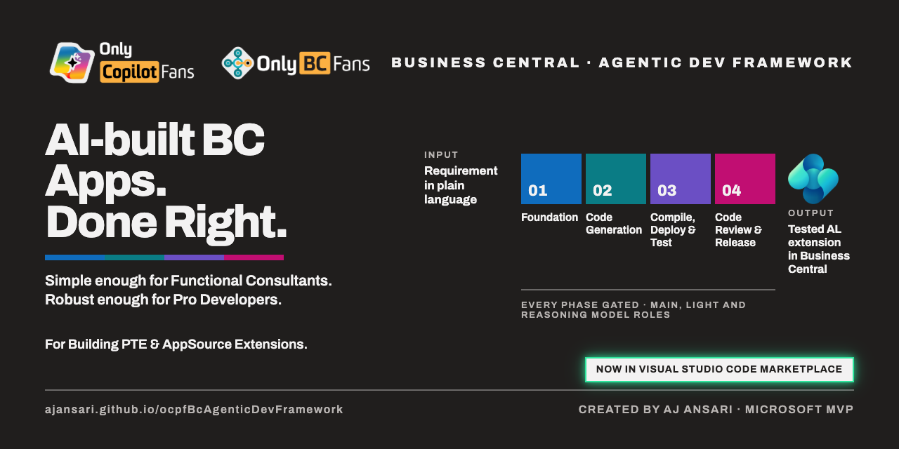
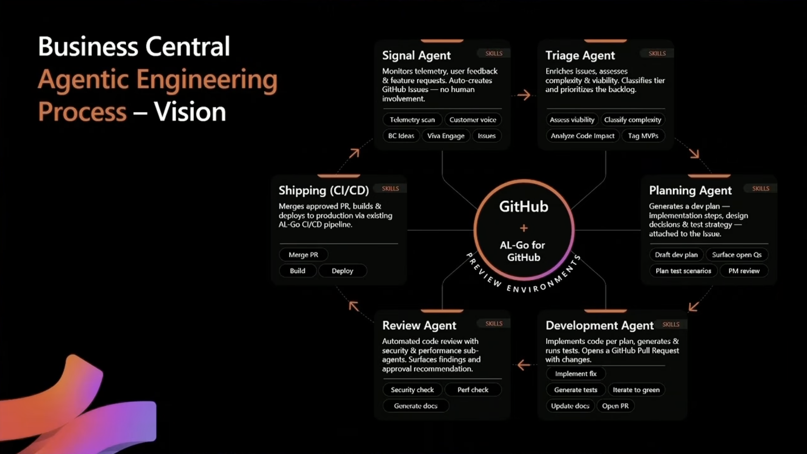

# OCPF BC Agentic Development Framework

**The OnlyCopilotFans Business Central Agentic Development Framework**

Simple Enough for Functional Consultants. Robust Enough for Pro Developers.  

*by AJ Ansari*

*Last Updated: Sunday, September 27, 2026*

> ## 🌐 [Official Website](https://ajansari.github.io/ocpfBcAgenticDevFramework/)
>
> **<https://ajansari.github.io/ocpfBcAgenticDevFramework/>**
>
> What the framework is, how it works, and what it produces. **Start here if you're new** — then
> come back for setup.

## Table of Contents

- [Background](#background)
- [User Guide](FrameworkUserGuide.md) — the full guide for the person driving a project
- [What's New?](#whats-new)
- [What to Expect](#expect)
- [GET STARTED: Agent Plugin (Recommended)](#setup-plugin)
- [Staying Up to Date](#staying-up-to-date)
- [Getting Started — Alternative Ways](GettingStartedAlternatives.md) (CLI tools, other hosts, manual setup)
- [Roadmap](#roadmap)
- [Repo Contents](#contents)
- [License](#license)
- [Project Inspiration](#inspiration)

<a id="background"></a>
<details open>
<summary><h1>Background</h1></summary>

This Agentic Development Framework was created to help Business Central Functional Consultants use AI to build AL extensions and apps the **right** way — though professional AL developers will find it just as useful.

The framework incorporates the AL MCP Server, BC Base App and System App documentation from Microsoft Learn, Microsoft's AL Guidelines, and BCQuality, grounding the agent's guidance in official references and quality tooling rather than AI guesswork alone. Alongside the runbook sits my **OCPF AL Development Standards Guide** — the detailed AL rules the routine applies at each step — which the agent fetches into your project automatically.

Both editions are multilanguage from the ground up. Captions and messages use XLIFF translation files, never `CaptionML`. Regional terminology comes from Microsoft's own Business Central translations. The agent drafts translations, a named human approves them, and UAT runs in every required language. You can also work with the agent in your own language. See [Multilanguage Support](translationAndMultiLanguage/MultilanguageSupportOverview.md).

It comes in two editions: the **full framework** (14 steps) for substantial projects, and **[Lite](GettingStartedAlternatives.md#lite-edition)** (7 steps) for smaller ones that need to move fast. Both apply the same AL standards.

</details>

<a id="whats-new"></a>
<details open>
<summary><h1>What's New?</h1></summary>

Each month's release notes in brief. The complete, versioned record is in
[fullVersion/RunbookChangelog.md](fullVersion/RunbookChangelog.md),
[liteVersion/LITE_RunbookChangeLog.md](liteVersion/LITE_RunbookChangeLog.md), and
[agentPlugin/ocpf-bc/CHANGELOG.md](agentPlugin/ocpf-bc/CHANGELOG.md).

## October 1, 2026 — Full v5.1.0.0 · Lite v5.1.0.0 · Operations Guide v5.1.0.0 · Plugin v5.1.0

**Every step now closes through the options box.** A real run on v5.0.0.0 closed Steps 1–7 with a
plain prompt and stalled: Rule 6c applied the check-in only "from Step 08 onward" (Lite: Step 5),
and Rule 6a and the Operations Guide both told the agent not to wrap "finishing a step" in the
box. All three now say the opposite, and every step file repeats it under its exit gate: the end
of every step and every phase — Full PRE-01 through Step 12, Lite 1 through 7 — ends with
**Proceed into the next step now (recommended)** / **Stop here** through `AskUserQuestion` (or
the harness's equivalent), and nothing of the next step starts until the human answers. The
final hand-off keeps its own two-option box. **A new Rule 6e** (both editions) makes resuming after
Escape, a stop, or a closed session re-ask whatever is still unanswered through the box, from the
project's files, and keep the step-close box from there on. No layout change, no migration;
`update-framework` replaces the files. Standards Guide unchanged at v1.11.0.0.

## September 27, 2026 — Full v5.0.0.0 · Lite v5.0.0.0 · Operations Guide v5.0.0.0 · Standards Guide v1.11.0.0 · Plugin v5.0.0

A major release for both editions, driven by what real projects on v4 showed. The project layout
changes, which is why the runbooks take a major version and why **projects in progress get a
migration**: the first `/ocpf-bc:update-framework` on an older project moves its files into the
new layout, after you approve, and logs every move in the ChangeLog.

### A front door on the Visual Studio Marketplace

The **OnlyCopilotFans Business Central Agentic Dev Framework - Setup** extension
([`ajansari.ocpf-bc-dev-setup`](https://marketplace.visualstudio.com/items?itemName=ajansari.ocpf-bc-dev-setup),
also on [Open VSX](https://open-vsx.org/extension/ajansari/ocpf-bc-dev-setup)) is now the
recommended install. One install brings the AL toolchain, the Claude Code and Copilot Chat
extensions, the plugin wiring, five **OCPF BC** Command Palette commands, and a first-run
walkthrough. It ships no framework content, so it never needs an update when the framework does.

### One `ocpfFramework/` folder, and documents by phase

Everything the framework fetches or keeps now lives in **one folder, `ocpfFramework/`**: the
guides, step files, templates, patterns, scripts, the plugin's marker, the runbook changelog, and a
`state/` folder for each developer's own usage, pricing, notification, and Copilot settings and the
update backups. The `.ocpf/` folder and the loose root-level folders are gone. Project documents
are grouped by phase — `docs/0-project/`, `1-define/`, `2-design/`, `3-build/`, `4-prove/` — and
AL source lives under `src/`. The project root holds only what the tools require.

### Lite gets `ProjectProgress.md`

Lite now keeps the same `ProjectProgress.md` as Full — a step tracker plus the usage and cost
table — created at Step 1 and updated at every step. `docs/UsageReport.md` is retired; the
migration carries its table over.

### Usage recorded at every step boundary, one row per model

A real project ended with one model credited for everything, because rows were written by hand
at the end. Now every step **starts** by timestamping and marking its tracker row *In Progress*,
and **closes** by running the measurement and writing **one row per model that ran in the step**
— the Main model and every sub-agent model — before the exit-gate message, which pastes the rows
so you see them without opening the file. The exit gate is not met until the rows exist, and a
Claude Code row is never hand-written.

### The AI effort estimate

Alongside the Human Effort Estimate, every project now writes `docs/2-design/AiEffortEstimate.md`
at the same step: predicted tokens per step, per model, and per token type; the cost at the
publisher's fetched prices; and a **wall-clock estimate from BUILD onward** that counts
generation time, compile-and-test rounds, and every approval the plan will raise at **30 minutes
each** — the document says so, and slower approvals extend the elapsed time by exactly the extra
wait. The margin is ±30 % until three measured projects exist in the calibration store the `usage`
command now writes at project close; then ±10 %. The human estimate is recalibrated for a fast
US senior AL developer, with a sanity anchor (a typical 10-object PTE lands at 15–30 hours), and
a partner can replace the baseline table with its own from `~/.ocpf/HumanEffortBaselines.md`.

### Faster code generation, batches in parallel

Full Step 05 asks once whether to **generate all batches in parallel** — one generator sub-agent
per batch, all at once, recommended with two or more batches when the tool runs sub-agents — or
one at a time. IDs and file names are fixed in the Build Plan first, so batches never conflict;
as each generator returns, the light-role pre-flight runs on it in the background while the
others continue. Lite asks the same when it has two batches. A new bundled **generator**
sub-agent runs on the Main model. In every mode the speed rules apply: one complete file per
write, no narration between files, symbols verified once per batch, and — with Opus as Main in
Claude Code — a one-time offer of fast mode with its price stated. All role delegations now run
as background sub-agents.

### Version numbers you can always upload

A new app's first build is **`0.0.0.1`**, and every build after it increments the Revision
segment; an existing app's first build increments from the version installed in the target
environment and keeps incrementing. Mechanical, no approval — never
two builds at one version, and the build scripts refuse to overwrite an existing package —
because a version already installed as a PTE can never be uploaded again. At the end of Full
Step 11 / Lite Step 6 the framework offers to build the **release candidate v1.0.0.0**; fixes
during release testing continue `1.0.0.1`, `1.0.0.2`, and **the package that passes ships as it
is**. Every build ends with a fixed message naming the package, the previous build, and the
**Schema Sync Mode** the upload needs (*Add*, or *Force Sync* with what changed and Microsoft's
sandbox warning).

### Code review scorecard

`CodeReview.md` opens with a scorecard: eight dimensions — standards compliance, correctness and
robustness, readability and maintainability, performance, security and permissions, upgrade
safety, translation readiness, test coverage — each graded A–F with one line of evidence, and an
overall grade that is the lowest of the eight. Lite writes the same table into its ChangeLog
entry.

### New model recommendations, and a warning about High

Before the model questions, both editions say once: *a High thinking effort makes every task
slower*. The recommendations are now **Sonnet Medium / Haiku Medium / Opus High** (Claude Code)
and **Gemini 3.8 Flash Medium / Auto Balanced / Claude Opus 5.5 High** (GitHub Copilot) for
Full's Main / Light / Reasoning roles; Lite recommends Sonnet Medium or Gemini 3.8 Flash Medium.

### Also in this release

- **App icon at intake.** The first step asks for one (*Yes — I'll provide an image* / *No icon*
  / *Later*). The agent resizes it to 300 × 300 px with what the machine has, pads a non-square
  image rather than cropping it, saves it as `src/logo/AppLogo.png`, and sets `"logo"` in
  `app.json`. For AppSource it is a release blocker.
- **Mermaid and PowerShell checked properly.** The framework checks for Node and the cached
  mermaid CLI the way that actually works (never `which mmdc`, which produced a false "not
  installed" on a real project), checks for PowerShell 7, and offers the install command for your
  operating system with your approval. Outcomes are recorded in `ocpfFramework/framework.json`.
- **Acknowledgements.** Every project writes `docs/0-project/Acknowledgements.md`, always
  committed: one row per third-party resource actually used, with author and license, and a note
  that nothing from any of them is bundled in the shipped `.app`.
- **Microsoft Learn only when necessary.** The downloaded symbols are the only routine lookup. The
  Base Application and System Application reference is consulted only when symbols are missing,
  the object isn't in them, or a pattern or event signature is needed — never as a second check
  — and every lookup says why it happened.
- **GitHub Copilot usage measured in AI credits** *(added September 29)*. Copilot has billed in AI
  credits since June 1, 2026, and VS Code records them per turn and per model in its chat session
  files. The usage script now reads those, so a Copilot project gets a credits table in
  `ProjectProgress.md` — AI credits and cost per step and model, sub-agents included, its total
  equal to the chat's *Session Cost* — instead of a row of *n/a*. Steps are separated by
  checkpoints taken at each step close. See *Token and cost tracking* under the previous release.
- **One version number** *(October 1)*. The Full runbook, Lite, the Operations Guide, and the plugin
  all ship as **5.0.0.0 / 5.0.0** and move together from here; the Standards Guide keeps its own
  line. The What's New headings before this one show the old, separate numbering.
- **A new license** *(October 1)*. The framework is released under the PolyForm Shield License
  1.0.0 — source-available, free to use, free to build commercial PTE and AppSource extensions
  with. See [License](#license).
- **A new user guide and a shorter front door.** [FrameworkUserGuide.md](FrameworkUserGuide.md)
  is the full guide for the person driving a project. The README's GET STARTED now has two steps
  — install the Visual Studio Code setup extension, run `/ocpf-bc:start` — and every other way in
  moves to [Getting Started — Alternative Ways](GettingStartedAlternatives.md).

## September 21, 2026 — Full v4.1.0.0 · Lite v3.1.0.0 · Standards Guide v1.10.0.0 · Plugin v3.1.0

Two mistakes kept appearing in apps built with the framework, in both editions and with both
agents: a **number-series field with no lookup** on the setup card or assisted setup wizard, and a
**child record created from its parent's page** (an IP app's entitlements, a document's lines) that
triggers *"The view is filtered, and the entry is outside the filter"* and disappears, saved with
its link field blank. The framework had a patterns-library entry for the second, but only as a
diagnostic aid consulted after a bug appeared, and no rule at all for either.

Both are now **Standards Guide Part 11**, with the exact AL shape each requires and the filter-group
facts behind it verified against Microsoft Learn (`SubPageLink` filters live in group 4,
`RunPageLink` filters in group 0, and the same child page is routinely opened both ways). The
design step records the link and the number series per object, the generation step reads Part 11
and the matching pattern files *before* writing a child list, setup page, or wizard, every sandbox
round runs the two client checks that prove them, and the human test script carries them as test
cases. Five new anti-pattern rows in Part 7 name the exact wrong forms.

## September 2026 — Full v4.0.0.0 · Lite v3.0.0.0 · Operations Guide v2.0.0.0 · Plugin v3.0.0

This release is about two things: **knowing what a project costs**, in AI usage and in the human
hours it replaces, and **making the framework itself lighter**, so that every step carries only
what it needs. It applies to both editions.

### Human Effort Estimate

Every project now produces `docs/2-design/HumanEffortEstimate.md` at the same moment its technical design is
written — Full Step 03, alongside the TDD; Lite Step 2, alongside the Design Doc. It is the number
of billable hours an **experienced senior AL developer** would need to deliver the same scope by
hand, broken down by task: requirements, design, each object by type and complexity, permission
sets, upgrade code, events, translations, testing, code review, documentation, and deployment.

The estimate is built from a published baseline table (hours per object type and per task) and a
stated complexity reason on every row, with every assumption listed so you can change it. It is an
estimate for comparison, not a quote, and the document says so. Its purpose is the column it feeds
next: the human hours sit beside the measured AI cost of the same step.

### Token and cost tracking

Every step is now measured. Each step's start and finish is timestamped, and at every exit gate the
framework refreshes a usage table — the second table in `ProjectProgress.md` for Full, and
`docs/UsageReport.md` for Lite *(retired in v5.0.0.0: both editions now use `ProjectProgress.md`)* — with one row per step and model:

| Column | What it holds |
|---|---|
| Input, output, cache write, cache read | Tokens consumed, per model, sub-agents included |
| Cost | At the publisher's published API rates, fetched and dated — never typed from memory |
| Elapsed, turns, decisions asked, sub-agent calls | How the step actually ran |
| Senior AL dev estimate | The hours from `docs/2-design/HumanEffortEstimate.md` for that step |

**With Claude Code**, the numbers are exact. Claude Code writes every request's usage to a session
transcript on disk, and the framework reads those files directly, deduplicated per request and with
the Reasoning and Light sub-agents counted. Prices come from Anthropic's pricing page, or from
Ollama's for its cloud models (local Ollama models cost nothing), stored with the source and the
date read.

**With GitHub Copilot in VS Code, the unit is the AI credit, and the table is a different
table.** Since June 1, 2026 every Copilot plan bills in AI credits: each model call's tokens are
priced at that model's published rate and converted to credits, at a published value per credit.
VS Code records the credits for every turn and every sub-agent call, per model, in the chat
session files it keeps on disk, and the framework reads those files directly, so the table shows
**AI credits and cost per step and per model**, and its total is the *Session Cost* you see in the
chat's Session Info popover. It has no token columns, because Copilot Chat records no token totals
by type, and no token figure is ever estimated for a Copilot step. Those session files are VS
Code's own storage, not a documented interface; if a VS Code release changes them, the agent asks
you for the one number in the popover and records that instead. Timestamps, elapsed time, and the
human-hours comparison work the same in both tools.

*An earlier version of this section said Copilot exposed premium requests only. That was true
until GitHub's billing change; the framework follows the new unit from Full v5.0.0.0 / Lite
v5.0.0.0.*

The plugin's `/ocpf-bc:usage` command does all of this; without the plugin, the Operations Guide
(Ops § Usage & Cost) describes the same procedure by hand.

### A lighter framework: the runbook split and document templates

The runbook you place as `CLAUDE.md` or `copilot-instructions.md` is loaded on **every** request the
agent makes. Until now that meant every FRD draft and every compile-and-fix round carried all
fourteen steps, the full parameter tables, and the checklists — most of it irrelevant to the step
in hand. Three changes remove that weight:

- **The runbook is now a short core plus one file per step.** The core keeps the operating rules,
  a few-line stub per step, and the always-on disciplines. The full text of each step lives in its
  own file, fetched into your project with the guides and read only when that step starts. The
  Full core went from 130 KB to 56 KB; Lite from 75 KB to 35 KB.
- **Every document has a template.** Eighteen templates — FRD, TDD, Sanity Check, Human Effort
  Estimate, Build Plan, ChangeLog, Gap Analysis, Code Review, Documentation, User Guide, test
  scripts, Deployment, Release Test Results, and the Lite set — fix each document's structure and
  closing checks, so the agent no longer re-decides structure or misses a section. The plugin's
  `/ocpf-bc:documents` command writes any of them.
- **Sub-agents get a narrow brief.** When the Reasoning role drafts the FRD, TDD, or Sanity Check,
  it now receives the step file, the template, the named inputs, and the exact Standards sections
  the template cites — not the whole runbook and both guides.

### Expected savings

The figures below are **estimates**, not measurements. The tracking above exists so that projects
on this version replace them with measured numbers; treat them as the direction and rough size of
the change, not as a promise.

| | Full | Lite |
|---|---|---|
| Runbook tokens carried on every request | about 58 % less | about 53 % less |
| DESIGN phase input tokens | 40 – 60 % less | 20 – 30 % less |
| DESIGN phase wall-clock time | 30 – 50 % less | 15 – 25 % less |
| Whole-project tokens | 20 – 35 % less | 15 – 25 % less |
| Whole-project cost | 15 – 30 % less | 10 – 20 % less |

**Where the savings come from, and why the ranges differ:**

- **Token carry.** At roughly four characters per token, the old Full runbook was about 33,000
  tokens on every request; the new core is about 14,000, plus 1,000 – 6,000 for the current step's
  file while that step is open. Most of that carry is billed at the cache-read rate, a fraction of
  the input rate, which is why the cost saving is smaller than the token saving — but the whole
  carry is re-written at the cache-write rate every time a session starts or the context is
  compacted, and that is where the old size cost the most.
- **The DESIGN documents.** Before this release, the Reasoning sub-agent read the entire runbook,
  the Operations Guide, and the Standards Guide — around 80,000 tokens — before writing a word of
  the FRD, TDD, or Sanity Check. The narrow brief is around 25,000 tokens, most of it the actual
  inputs. This is the largest single saving, and Full applies it three times. Lite has no
  sub-agents, so it gains only from the smaller core and the templates, hence its lower range.
- **Time.** Reading tokens is fast. The time went into re-deciding document structure, re-reading
  guides the document did not need, and revision rounds when a draft missed a required section.
  Templates remove the first and third; the brief removes the second. Output tokens — which
  dominate generation time — are unchanged, so time falls less than input tokens do.
- **What does not shrink.** BUILD and PROVE were already light on carry, and code generation
  produces the same output as before. Whole-project figures are therefore diluted versions of the
  DESIGN figures.

### Also in this release

- **GitHub Copilot session settings, asked once.** When Copilot is in use, the first step asks how
  many requests an agent turn may make before pausing (150 recommended — the default is what
  triggers *"Copilot has been working on this problem for a while…"*) and how tool approvals should
  work (ask each time, allow the framework's own commands, or allow everything, with VS Code's own
  warning). The answers are written to the workspace's `.vscode/settings.json`.
- **What to Expect** — a new section of this README on the interactive first hour, when you can
  step away, and how each tool notifies you, including mobile notifications and answering from
  your phone with Claude Code.
- **Coming next:** a token usage *estimator*, giving a predicted range before a step runs, once
  enough measured projects exist to calibrate it; and an optional intake sheet you can fill in
  outside the chat.

</details>

<a id="expect"></a>
<details open>
<summary><h1>What to Expect</h1></summary>

**Plan on the first hour being interactive, and treat it as the most important hour of the
project.** Think of it as the kickoff meeting you would hold with a human developer you had just
hired to build this extension. In that meeting you would not say "track bootcamp registrations"
and leave the room. You would explain who uses it and why, which countries and languages they work
in, what it must never do, what it connects to, and how you will know it is right — because
anything you left vague, the developer would have to guess at, and you would find out about the
guess weeks later, in the wrong place, at the cost of a rewrite. The framework is that developer.
In its first hour it asks for everything it needs before it designs anything: your working language,
how to be notified, which models do the work, who signs off, the extension's name and publisher, ID
ranges, countries and languages, and the problem itself — what the app is for, who it serves, and
what is out of scope.

Stay at the keyboard for it. Answer the option boxes, correct anything it suggests, and say more
rather than less when it asks about the problem. Nothing reaches the parameter sheet until you pick
it, and nothing reaches the design until the problem statement is signed off — which means this is
the one point in the project where a better answer costs a minute. **Vagueness here does not
disappear; it flows downstream.** An unstated rule becomes a requirement the FRD never captured, an
object the TDD designed wrong, code that compiles cleanly and does the wrong thing, and a rewrite
that costs more time and more tokens than the conversation would have — exactly as it does with a
human developer, and for the same reason.

**Once the DESIGN phase begins — Full Step 02 (the FRD), Lite Step 2 (the Design Doc) — you can step
away.** From there the framework works in longer stretches and comes back to you only to approve a
document, decide between options, or answer a question. Turn on notifications at the first step and
you'll know the moment it's your turn.

### How you get notified

| | Claude Code | GitHub Copilot |
|---|---|---|
| **Sound** on the computer | Yes | Yes |
| **Desktop notification** (operating system) | Yes — Windows, Linux, and supported terminals on macOS (not the VS Code extension on macOS) | Yes — VS Code's own notification when input is needed |
| **Mobile notification** | Yes — through **Remote Control**, with the Claude app installed on your phone and signed in to the same account as Claude Code in VS Code | No |
| **Answer from the phone** | Yes — in the Claude app you can read the question, choose an option, and approve an action | No |

The framework asks which of these you want at its first step (right after the working language),
sets them up itself, and remembers the answer per project. With Claude Code, choosing *Claude app*
turns on Remote Control; the framework explains what that stores before turning it on.

**Using GitHub Copilot?** At the same first step the framework asks two Copilot-specific questions:
how many requests an agent turn may make before Copilot pauses (the default is low enough that a
design step hits *"Copilot has been working on this problem for a while…"* — 150 is recommended), and
how tool approvals should work (ask each time, allow the framework's own commands, or allow
everything, with its warning). It writes your answers to the workspace's `.vscode/settings.json`.

**What it costs, and what it saves.** Every step is measured: tokens by type per model in
Claude Code, AI credits per model in GitHub Copilot, priced from the publisher's
published rates, next to an estimate of the hours an experienced senior AL developer would bill for
the same step, and next to the AI effort estimate made before BUILD began. The table lives in
`ProjectProgress.md` in both editions, with one row per step and model, written at every step
boundary.

</details>

<a id="setup-plugin"></a>
<details open>
<summary><h1>GET STARTED: Agent Plugin (Recommended)</h1></summary>

> ### Two steps. Install once, then one command per project.
>
> | | |
> |---|---|
> | **1. Install the Visual Studio Code extension** | Once per machine. One install brings everything. |
> | **2. Start your project** | Open your AL folder and run `/ocpf-bc:start`. |

That's it. From there the plugin **helps you choose Full or Lite**, **installs the latest runbook**,
**connects Microsoft's AL tools** with nothing to install, **adds sub-agents** for the Reasoning,
Light, and Generator roles, and **checks for updates** each session before changing anything.

## Step 1 — Install the Visual Studio Code extension

You build Business Central extensions in **Visual Studio Code** with the **AL Language** extension,
so the framework's front door is a Visual Studio Code extension:

> ### [OnlyCopilotFans Business Central Agentic Dev Framework - Setup](https://marketplace.visualstudio.com/items?itemName=ajansari.ocpf-bc-dev-setup)
> on the **Visual Studio Marketplace** — `ajansari.ocpf-bc-dev-setup`

Install it from the Marketplace page, or paste this into Quick Open (**Ctrl+P**, **Cmd+P** on Mac):

```text
ext install ajansari.ocpf-bc-dev-setup
```

**One install brings:** the AL toolchain (the AL Language extension and its companions), the agent
extension you choose (Claude Code or GitHub Copilot Chat), the framework's plugin marketplace wired
into that agent, the `ocpf-bc` plugin itself, a Git check, five **OCPF BC** Command Palette commands
(*New AL Project + Framework*, *Kickstart Framework Here*, *Set Up Claude Code*, *Set Up GitHub
Copilot*, *Check Git Installation*), and a first-run walkthrough that ends at `/ocpf-bc:start`.
The extension's own documentation is on its Marketplace page. Requirements: Visual Studio Code
1.96 or later, Git, and a Claude or GitHub Copilot subscription.

**Using VSCodium or another Open VSX client?** The same extension is on the
[Open VSX Registry](https://open-vsx.org/extension/ajansari/ocpf-bc-dev-setup).

**Extension not an option?** Working in the **Claude Code CLI** or the **GitHub Copilot CLI**,
running the agent on github.com, in the Claude apps, or in Copilot Cowork, or setting the framework
up by hand without the plugin — every one of those is in
**[Getting Started — Alternative Ways](GettingStartedAlternatives.md)**.

## Step 2 — Start a project

Open your AL project folder — or an empty one — and run:

> # `/ocpf-bc:start`

Or just ask:

> # *"Start a Business Central project with the OCPF framework."*

In GitHub Copilot, the commands are identical.

**The plugin then walks you through four things:**

| | What happens | What you do |
|---|---|---|
| **1** | **Full or Lite.** It asks about the project — object count, people and sign-off roles, whether it's heading to AppSource — and recommends an edition with its reasoning. | Confirm or override. You can switch later without losing work. |
| **2** | **Where the runbook goes.** It places the latest runbook as `CLAUDE.md`, `.github/copilot-instructions.md`, or both for mixed teams. | Nothing, unless a file already exists — then it asks. **It never overwrites.** |
| **3** | **AL tools, nothing to install.** It connects Microsoft's AL tools using the AL Language extension you already have. | In Copilot Chat, nothing — they're built in. In Claude Code, approve the connection once. |
| **4** | **The routine begins.** | Tell it your working language, how you want to be notified, which models do the work, and — with Copilot — the request limit and approval mode — Full asks for a Main, Light, and Reasoning model with a thinking effort each (recommended **Sonnet Medium / Haiku Medium / Opus High** in Claude Code, **Gemini 3.8 Flash Medium / Auto Balanced / Claude Opus 5.5 High** in Copilot); Lite asks for one (Sonnet Medium or Gemini 3.8 Flash Medium). It warns first that a High thinking effort makes every task slower, and recommends High only where judgment matters most. The Full framework then runs its Reasoning, Light, and Generator sub-agents — Lite its Generator — on exactly the models you chose, and every document lands in its phase folder — `docs/0-project/`, `1-define/`, `2-design/`, `3-build/`, `4-prove/` — with the usage table in `ProjectProgress.md` for both editions. |

**Other commands, for later:**

| Command | What it does |
|---|---|
| `/ocpf-bc:status` | Shows where the project stands |
| `/ocpf-bc:update-framework` | Checks for a newer runbook |
| `/ocpf-bc:al-mcp-setup` | Connects the AL tools, if you skipped it at start |
| `/ocpf-bc:notifications` | Turns on "your turn" notifications in an older project |
| `/ocpf-bc:roles` | Asks which models do the work (Full: Main, Light, Reasoning, each with a thinking effort; Lite: one) and makes the answer take effect by writing the project's three sub-agent copies — the runbook runs it at its first step; run it by hand to change or repair the assignment |
| `/ocpf-bc:documents <name>` | Writes any project document from its template into its phase folder under `docs/` — FRD, TDD, Sanity Check, Human and AI Effort Estimates, Build Plan, Code Review, User Guide, Acknowledgements, and the rest — with only the inputs its step names |
| `/ocpf-bc:usage --step <id>` | Run at every step boundary: measures tokens and cost per step and model (Claude Code) or AI credits and cost per step and model (GitHub Copilot in VS Code), fetches published prices, and writes one row per model into the usage table in `ProjectProgress.md` (both editions); at project close it exports the calibration file for the AI effort estimator |

</details>

<a id="staying-up-to-date"></a>
<details open>
<summary><h1>Staying Up to Date</h1></summary>

Two separate things get updated. The plugin handles each one differently.

### 1. Your project's runbook: checked automatically, applied when you say so

A project keeps its own copy of the runbook, so the rules don't change halfway through without
your say.
- **At the start of every session,** the framework checks this repository for a newer runbook.
- **If there is one,** it tells you what changed and asks: **Update now**, **Not now**, or **Skip
  this version**.
- **On Update now,** it keeps a backup of the old copy in `ocpfFramework/state/previous/` and logs
  the change in your project.
- **Updating a project from an older layout** (Full before 5.0.0.0, Lite before 5.0.0.0) also
  moves its files into the `ocpfFramework/` folder and the `docs/` phase folders — a migration,
  applied only after you approve the update and listed move by move in the ChangeLog.

**What it needs:** internet access to GitHub (`raw.githubusercontent.com`). There's nothing to set
up. This applies to projects started with the plugin. Manually set-up projects work as before, and
you can run `/ocpf-bc:update-framework` in them anytime.

### 2. The plugin itself: depends on your tool

| Tool | Automatic? | To turn on automatic updates | To check by hand |
|---|---|---|---|
| **Claude Code** (VS Code, CLI, Desktop) | **Off by default** for third-party marketplaces like this one | `/plugin` → **Marketplaces** → **onlycopilotfans** → **Enable auto-update**. Updates then install in the background, and you're prompted to run `/reload-plugins`. | `/plugin marketplace update onlycopilotfans`, then `/plugin update ocpf-bc@onlycopilotfans` |
| **GitHub Copilot Chat in VS Code** | **On,** when VS Code's `extensions.autoUpdate` is on (the default). Checked every 24 hours. | Nothing to do | Command Palette → **Extensions: Check for Extension Updates** |
| **GitHub Copilot CLI** | **Off** for added marketplaces, but `/plugin` shows when an update is available | Add `"autoUpdate": true` to the `onlycopilotfans` entry under `extraKnownMarketplaces` in `~/.copilot/settings.json` | `copilot plugin update ocpf-bc` |
| **GitHub.com cloud agent** | **Yes:** the plugin is installed from this repository when a session starts | Nothing to do | Nothing to do |
| **Claude apps (Chat, Cowork)** | Checked from the marketplace | Nothing to do | **Customize** → **Plugins** → **Update** on the marketplace |
| **Microsoft Copilot Cowork** | **No** | Not available | Download the newer `.zip` from Releases and upload it again. If you shared it, select **Re-share**. |

### Get notified of new releases

- **Watch this repository** on GitHub: **Watch** → **Custom** → **Releases**. GitHub then emails
  you when a new version is published.
- The [fullVersion/RunbookChangelog.md](fullVersion/RunbookChangelog.md) and
  [agentPlugin/ocpf-bc/CHANGELOG.md](agentPlugin/ocpf-bc/CHANGELOG.md) files record what changed
  in each version.

</details>

<a id="roadmap"></a>
<details open>
<summary><h1>Roadmap</h1></summary>

- ~~Add support for AL MCP~~ ✅ Completed
- ~~Add support for BCQuality~~ ✅ Completed
- ~~Add support for multi language translations~~ ✅ Completed — see [Multilanguage Support](translationAndMultiLanguage/MultilanguageSupportOverview.md)
- ~~Distribute as an agent plugin for Claude and GitHub Copilot~~ ✅ Completed — see [GET STARTED: Agent Plugin](#setup-plugin)
- ~~Per-step runbook files, document templates, a human effort estimate, and per-step token and cost tracking~~ ✅ Completed — Full v4.0.0.0 / Lite v3.0.0.0, September 2026
- ~~Token usage **estimator** — predicted tokens per model, by input, output, and cached, before a step runs~~ ✅ Completed — the AI Effort Estimate, Full v5.0.0.0 / Lite v5.0.0.0, September 2026; calibrates itself from measured projects
- Optional human-fillable intake sheet (not Markdown) to answer the simple intake questions up front and skip them in chat

</details>

<a id="contents"></a>
<details open>
<summary><h1>Repo Contents</h1></summary>

| File | Purpose |
|---|---|
| `fullVersion/` | The **Full Framework** — the complete 14-step routine. See [Full Framework, by hand](GettingStartedAlternatives.md#setup-full). |
| `standardsGuide/ocpfALDevStandardsGuide.md` | The companion **OCPF AL Development Standards Guide** — the detailed AL rules the runbook cites as **Standards §** (coding standards, API page design, field inclusion, naming, ID allocation, gap analysis, anti-patterns, translation and multilanguage, upgrade and data migration, events and extensibility, and the AppSource manifest and submission requirements). You don't need to copy this one by hand: the runbook fetches it from this repository into every project's `ocpfFramework/standardsGuide/` at PRE-01, and gitignores it there. Shared by both editions. |
| `opsGuide/ocpfOperationsGuide.md` | The companion **OCPF Operations Guide** — the procedures both editions share, cited as **Ops §** (how the agent asks and gets approval, intake, roles, project setup, the AL tools, analyzers, symbols, editor sync, notifications, packaging, repository hygiene, translations, automated tests, fetched companions, reference sources, and the plugin). Fetched into each project's `ocpfFramework/opsGuide/` alongside the Standards Guide. |
| `liteVersion/` | The **Lite Edition** — a 7-step version of the framework for small, fast-moving projects. See [Lite Edition, by hand](GettingStartedAlternatives.md#lite-edition). |
| `documentTemplates/` | One template per document the framework produces (FRD, TDD, Sanity Check, Human Effort Estimate and its baselines, AI Effort Estimate, Build Plan, ChangeLog, Gap Analysis, Code Review, Documentation, User Guide, test scripts, Deployment, Release Test Results, Acknowledgements, Project Progress with its usage table for both editions, and Lite's Design Doc, Docs, and Test Script). Fetched into each project's `ocpfFramework/documentTemplates/` with the step files; shared by both editions. |
| `translationAndMultiLanguage/MultilanguageSupportOverview.md` | How the framework handles multilanguage — captions and XLIFF translation files, regional terminology (GST vs. VAT, CR/Adj Note vs. Credit Memo in Australia), agent-drafted translations with a human review gate, and language-aware UAT. Shared by both editions. |
| `agentPlugin/` | The optional **agent plugin**, `ocpf-bc`, for Claude Code, GitHub Copilot, and other tools. See [GET STARTED: Agent Plugin](#setup-plugin). This repository is also its plugin marketplace (`.claude-plugin/marketplace.json`). |
| `THIRD_PARTY_NOTICES.md` | Credits and licenses for every third-party resource the framework references, fetches, or recommends — BCQuality, AL Guidelines, Microsoft Learn, and others. |
| `FrameworkUserGuide.md` | The **User Guide** — everything the person driving a project needs: install, the Command Palette commands, the plugin commands, where every file lives, model recommendations, versioning, and updating. |
| `GettingStartedAlternatives.md` | Every other way to get started: installing the plugin from the Claude Code CLI, the GitHub Copilot CLI, or inside Visual Studio Code without the setup extension; running the agent on github.com, in the Claude apps, or in Copilot Cowork; and the manual, no-plugin setup for Full and Lite. |

</details>

<a id="license"></a>
## License

This project is licensed under the **[PolyForm Shield License 1.0.0](https://polyformproject.org/licenses/shield/1.0.0)**
(see [LICENSE](LICENSE)). It is a **source-available** license, not an open source license, and
in practice that means:

- **Free to use.** There is nothing to buy and no registration.
- **The source is available.** Every file in this repository — the runbooks, the Standards Guide,
  the Operations Guide, the templates, the plugin, and the scripts — is here to read, run, and
  adapt.
- **Build what you like with it.** Use the framework to build Business Central AL extensions,
  per-tenant or AppSource, free or commercial, for yourself or for clients. The extensions you
  build are yours; the license says nothing about them.
- **The one reservation** is the license's noncompete: you may not use the framework to provide a
  product that competes with it, or with a product its licensor provides using it — for example
  by repackaging it as your own agentic development framework or development tool.

Copyright © 2026 AnsariCo, Inc. dba [OnlyCopilotFans](https://OnlyCopilotFans.com) and
[OnlyBCFans](https://OnlyBCFans.com). Third-party resources the framework references, fetches, or
recommends keep their own licenses, credited in [THIRD_PARTY_NOTICES.md](THIRD_PARTY_NOTICES.md).

<a id="inspiration"></a>
<details open>
<summary><h1>Project Inspiration</h1></summary>

The spark for this project was Microsoft's **Business Central Agentic Engineering Process** vision, first unveiled at Directions North America in Orlando in April 2026.



*Microsoft's Business Central Agentic Engineering Process vision, as presented at BC TechDays 2026.*

I've been teaching an AL development bootcamp at Community Summit NA since 2023. The bootcamp is typically geared toward developers, but for many years I've also led workshops and sessions on AL development aimed squarely at Functional Consultants. With the rise of vibe coding — and all the ill effects that come with taking that approach to business-critical code and apps — I wanted to create a framework that would let Functional Consultants and other non-developers use AI and agentic development tools to build AL extensions not just quickly, but the **right** way: the way a professional developer would build a BC app.

What I wanted was for a Functional Consultant to be able to interface with an AI or agentic dev tool the same way they would interface with a human BC developer — and to expect the same quality of work and the same outputs, without incurring unnecessary technical debt along the way.

With that in mind, I built my first proof of concept by May, centered on an AL Standards Guide I had written, and had a proper first version of the agentic development framework by early June. After extensive prototyping, internal use, testing, and iteration, I debuted it to an external audience at Days of Knowledge ANZ in Melbourne in August 2026, to very positive feedback.

In the time since, my focus has turned to fine-tuning the framework and enhancing its user experience — making it more interactive, creating a Lite version for smaller projects, and integrating with popular tools like the AL MCP Server and BCQuality.

At the heart of this project is a simple vision: that this framework should be **Simple Enough for a Functional Consultant, but Robust Enough for a Pro Developer**.

</details>
