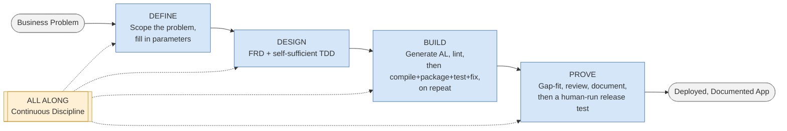
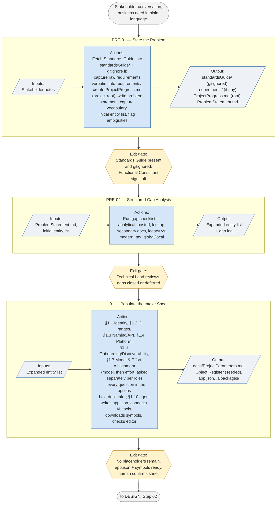
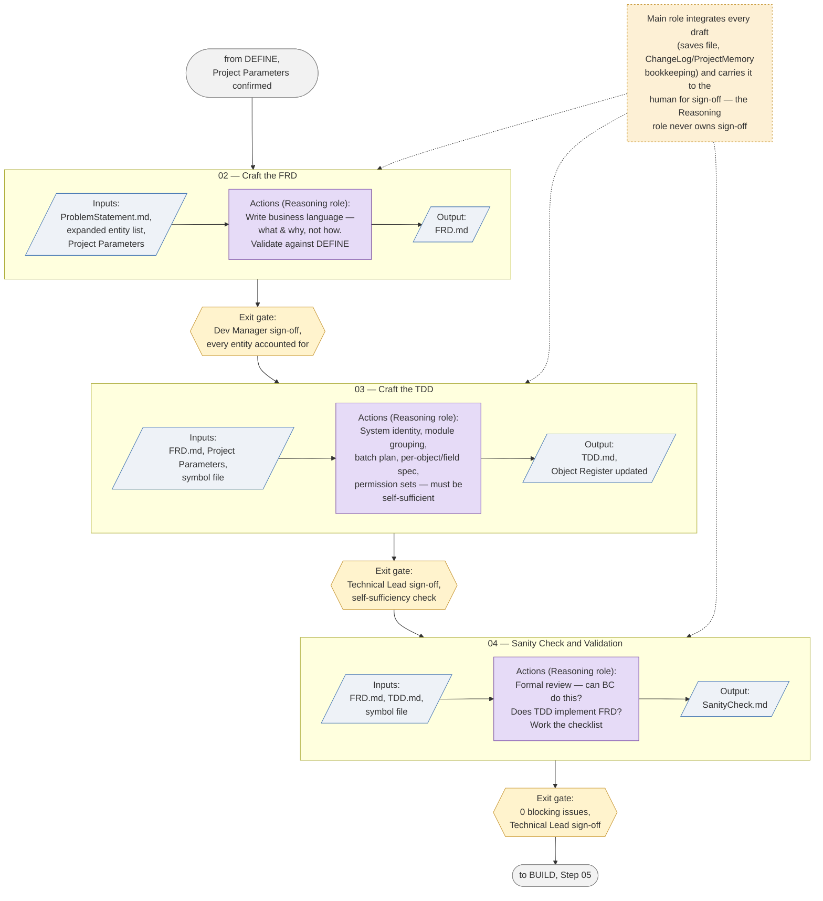
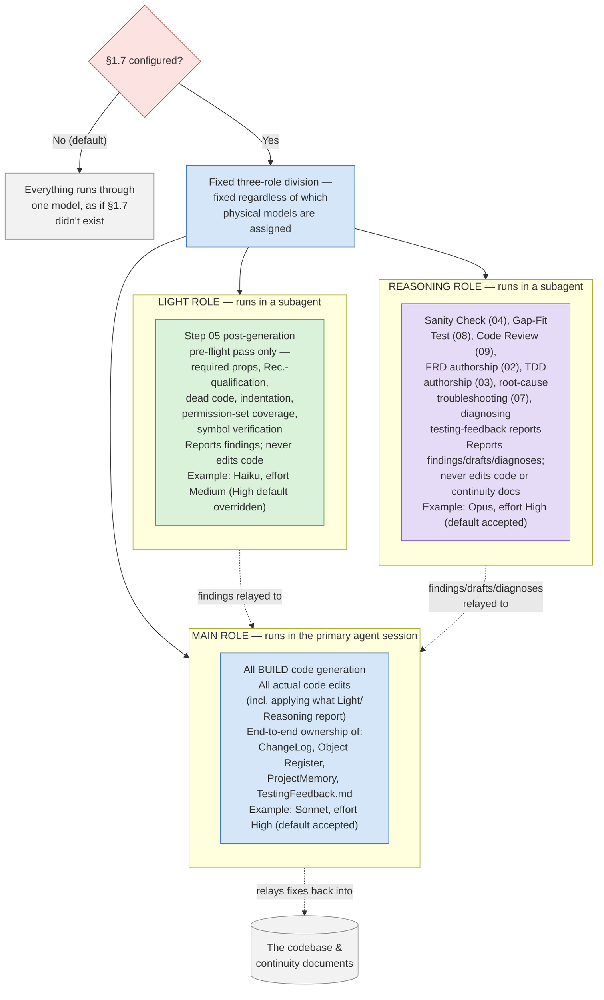

# Agentic Development Framework — Schematics

Visual companion to the runbook (see `BC_App_Build_Routine_Agent.md` for the authoritative text,
`RunbookChangelog.md` for its version history, and `standardsGuide/ocpfALDevStandardsGuide.md` for
the AL rules it cites as **Standards §**). These diagrams are a reading aid, not a source of
truth — if a diagram and the runbook text ever disagree, the runbook wins and this file is stale
and needs updating.

Every diagram below was extracted and rendered through `@mermaid-js/mermaid-cli` before being
committed here, per the same discipline the runbook itself requires at Step 11 ("never ship a
diagram you have not seen render"). Markdown can store a syntactically invalid Mermaid diagram
that looks fine in the source and simply fails to draw wherever it's viewed — that check is what
catches it before a reader does.

**Shape legend, used consistently across every diagram below:**

| Shape | Meaning |
|---|---|
| `(( stadium ))` | Start / end point of a flow |
| `[ rectangle ]` | An action, step, or process |
| `[/ parallelogram /]` | Input or output (data, a document) |
| `{{ hexagon }}` | An exit gate / checkpoint |
| `{ diamond }` | A decision point |
| `[[ subroutine ]]` / dashed box | A cross-cutting concern (ALL ALONG) |

**Color legend** (role diagrams and BUILD only): blue = Main role, green = Light role,
purple = Reasoning role. Where §1.7 role assignment isn't configured, every colored step is done
by the single running model instead.

---

## 1. High-Level Overview

The whole framework in one picture: four phases in sequence, with ALL ALONG's continuous
discipline running underneath every one of them.

---

## 2. Deeper Level — Full Step & Gate Flow

Every step across all four phases, in order, with the exit gate that must be met before the next
one can start (the runbook's own rule: "do not start a step until its predecessor's exit gate is
met").

```mermaid
flowchart TD
    subgraph DEFINE["PHASE: DEFINE"]
        direction TB
        PRE01["PRE-01<br/>State the Problem"] --> G_PRE01{{"Functional Consultant<br/>signs off"}}
        G_PRE01 --> PRE02["PRE-02<br/>Structured Gap Analysis"]
        PRE02 --> G_PRE02{{"Technical Lead reviews,<br/>gaps closed/deferred"}}
        G_PRE02 --> S01["01 — Populate Intake Sheet<br/>(Project Parameters, incl. §1.6/§1.7)"]
        S01 --> G_S01{{"No placeholders,<br/>human confirms sheet"}}
    end

    subgraph DESIGN["PHASE: DESIGN"]
        direction TB
        S02["02 — Craft FRD"] --> G_S02{{"Dev Manager sign-off"}}
        G_S02 --> S03["03 — Craft TDD"]
        S03 --> G_S03{{"Technical Lead sign-off,<br/>self-sufficiency check"}}
        G_S03 --> S04["04 — Sanity Check"]
        S04 --> G_S04{{"0 blocking issues"}}
    end

    subgraph BUILD["PHASE: BUILD"]
        direction TB
        S05["05 — Plan the Code"] --> G_S05{{"Batch order agreed,<br/>scaffold structurally complete"}}
        G_S05 --> S06["06 — Code Generation<br/>(per-batch loop, no compile)"]
        S06 --> G_S06{{"Every batch pre-flight clean,<br/>permission-set coverage verified"}}
        G_S06 --> S07["07 — Compile and Package,<br/>Troubleshoot, Iterate<br/>(mandatory compile-and-package,<br/>then a sandbox test/fix/repackage cycle)"]
        S07 --> G_S07{{"0 errors / 0 warnings,<br/>sandbox testing clean"}}
    end

    subgraph PROVE["PHASE: PROVE"]
        direction TB
        S08["08 — Gap-Fit Test<br/>(code-touching gaps loop back<br/>through Step 07's cycle)"] --> G_S08{{"Every gap classified,<br/>resolved or scheduled"}}
        G_S08 --> S09["09 — Code Review<br/>(code-touching fixes also<br/>loop back through Step 07)"]
        S09 --> G_S09{{"Critical findings resolved,<br/>dead-code scan clean"}}
        G_S09 --> S10["10 — Update Design Documents"]
        S10 --> G_S10{{"As-built TDD complete,<br/>FRD reflects reality"}}
        G_S10 --> S11["11 — Document the Code<br/>(asks: Automated Test Scripts too?)"]
        S11 --> G_S11{{"4 docs exist (+ 1 conditional),<br/>ready for release testing"}}
        G_S11 --> HandOff2{{"Formal hand-off message —<br/>the framework's own work is done"}}
        HandOff2 --> S12["12 — Release to Users<br/>for Testing"]
        S12 --> G_S12{{"Green tests pass,<br/>red tests fail gracefully →<br/>same package ships to Production"}}
    end

    G_S01 --> S02
    G_S04 --> S05
    G_S07 --> S08

    classDef step fill:#d4e6f7,stroke:#4a7ab5,stroke-width:1px;
    classDef gate fill:#fff3cd,stroke:#c99a3a,stroke-width:1px;
    class PRE01,PRE02,S01,S02,S03,S04,S05,S06,S07,S08,S09,S10,S11,S12 step;
    class G_PRE01,G_PRE02,G_S01,G_S02,G_S03,G_S04,G_S05,G_S06,G_S07,G_S08,G_S09,G_S10,G_S11,G_S12,HandOff2 gate;
```

---

## 3. Phase Schematics

### 3.1 DEFINE

### 3.2 DESIGN

### 3.3 BUILD

The phase most reshaped by this project's own lessons: no per-batch compile, symbol-verified
lint instead, one mandatory compile-and-package once every planned batch exists, then a
continuous sandbox test/fix/repackage cycle rather than a single event.

```mermaid
flowchart TD
    Start(["from DESIGN,<br/>TDD signed off"]) --> S05

    subgraph S05["05 — Plan the Code"]
        direction LR
        In1[/"Inputs:<br/>TDD.md, Object Register"/] --> Act1["Actions:<br/>Confirm batch order,<br/>prepare scaffold (confirm<br/>app.json, AL tools, symbols),<br/>fetch BCQuality snapshot<br/>+ OCPF Patterns library,<br/>write pre-flight checks<br/>(pre-gen + post-gen passes)"] --> Out1[/"Output:<br/>Batch plan, scaffold,<br/>pre-flight checklist"/]
    end
    S05 --> Gate1{{"Exit gate:<br/>Batch order agreed,<br/>scaffold structurally complete<br/>(not compiled)"}}

    Gate1 --> S06

    subgraph S06["06 — Code Generation (repeats per batch)"]
        direction TB
        B1["Pause for human approval,<br/>then generate batch's AL files<br/>from standard template"]
        B1 --> PreGen["Pre-generation pre-flight<br/>(Main role): identifier length,<br/>reserved keywords, localization,<br/>ObsoleteState — on planned<br/>names/fields; fix TDD if needed"]
        PreGen --> PostGen["Post-generation pre-flight<br/>(Light role): required props,<br/>Rec.-qualification, dead code,<br/>indentation, permission-set<br/>coverage, symbol verification —<br/>reports findings, Main role fixes"]
        PostGen --> PermCheck["Verify permission-set coverage<br/>across ALL batches so far<br/>(Light role) — design-time check,<br/>independent of compiling"]
        PermCheck --> MoreBatches{"More batches<br/>in the plan?"}
        MoreBatches -- "Yes" --> B1
    end
    MoreBatches -- "No — every planned<br/>batch generated" --> Gate2{{"Exit gate:<br/>Every batch pre-flight clean,<br/>permission-set coverage verified<br/>— NO compile required here"}}

    Gate2 --> S07
    subgraph S07["07 — Compile and Package,<br/>Troubleshoot, Iterate"]
        direction LR
        Compile["FIRST: compile the whole<br/>extension once, then package it —<br/>the one mandatory compile-and-<br/>package (Op. Rule 4)"] --> Deploy["Publish package<br/>to BC sandbox"]
        Deploy --> Test["Test — manually by the<br/>human, or via the optional<br/>agent-run MCP API pass"]
        Test --> Q{"Errors, warnings,<br/>or issues found?"}
        Q -- "Yes" --> Diag["Check patterns/ first, then<br/>reasoning role diagnoses:<br/>one-off or pattern? where<br/>from? what rule missed it?"]
        Diag --> Fix["Main role fixes root cause,<br/>regenerates files, logs<br/>ChangeLog + updates TDD"]
        Fix --> Repackage["Compile AND package again<br/>(not just recompile)"]
        Repackage --> Deploy
        Q -- "No" --> Clean["0 errors / 0 warnings,<br/>sandbox testing clean"]
        Clean --> APICheck{"Offer: live MCP<br/>connection available<br/>and human wants it?"}
        APICheck -- "Yes (optional)" --> APITest["Agent runs full green/red-team<br/>checklist against the sandbox API"]
        APICheck -- "No / declined" --> Manual["Suggest manual testing instead:<br/>Postman, Power Automate,<br/>Power Apps, or Copilot Studio"]
    end
    APITest --> Gate3
    Manual --> Gate3

    Gate3{{"Exit gate:<br/>Full extension compiles clean,<br/>human confirms sandbox testing<br/>clean, ChangeLog & TDD reconciled"}}

    Gate3 --> Next(["to PROVE, Step 08"])

    classDef io fill:#eef2f7,stroke:#4a7ab5,stroke-width:1px;
    classDef act fill:#d4e6f7,stroke:#4a7ab5,stroke-width:1px;
    classDef light fill:#d9f2d9,stroke:#4a9b4a,stroke-width:1px;
    classDef reasoning fill:#e6dbf7,stroke:#7d52a8,stroke-width:1px;
    classDef gate fill:#fff3cd,stroke:#c99a3a,stroke-width:1px;
    classDef endpoint fill:#f2f2f2,stroke:#888,stroke-width:1px;
    classDef decision fill:#fde2e2,stroke:#c0504d,stroke-width:1px;
    class In1,Out1 io;
    class Act1,B1,Fix,Compile,Deploy,Test,Repackage,APITest,Manual act;
    class PostGen,PermCheck light;
    class PreGen act;
    class Diag reasoning;
    class Gate1,Gate2,Gate3 gate;
    class Start,Next,Clean endpoint;
    class MoreBatches,Q,APICheck decision;
```

### 3.4 PROVE

> **Restructured September 13, 2026 (AJ Ansari).** Old Step 09 ("Package and Test the App") is gone —
> compiling and packaging is now a continuous cycle that started back in Step 07 (BUILD), not a
> milestone reserved for here. A new Step 12 ("Release to Users for Testing") closes PROVE
> instead, running the same green/red-team checklist by hand, against the `HumanUnitTestScript.md`
> that Step 11 (formerly Step 12) actually wrote — old Step 09 tried to run that checklist before
> the script it depends on existed.

```mermaid
flowchart TD
    Start(["from Step 07,<br/>extension compiles/packages 0/0,<br/>at least one sandbox test done"]) --> S08

    subgraph S08["08 — Gap-Fit Test, Fidelity Validation"]
        direction LR
        In1[/"Inputs:<br/>FRD.md, TDD.md,<br/>built AL, ChangeLog"/] --> Act1["Actions (Reasoning role):<br/>Three-way comparison —<br/>FRD vs. TDD vs. as-built.<br/>Classify every gap"] --> Out1[/"Output:<br/>GapAnalysis.md,<br/>gap-fill work items"/]
    end
    S08 --> GapFill{"Any Oversight gap<br/>needs a code fix?"}
    GapFill -- "Yes" --> GapCycle08["Step 07 cycle again —<br/>fix, compile, package,<br/>redeploy, retest<br/>(Operating Rule 4)"]
    GapCycle08 --> Gate1
    GapFill -- "No (doc-only)" --> Gate1
    Gate1{{"Exit gate:<br/>Every gap classified,<br/>resolved or scheduled,<br/>code fixes recompiled/repackaged"}}

    Gate1 --> S09

    subgraph S09["09 — Code Review"]
        direction LR
        In3[/"Inputs:<br/>Full built extension,<br/>TDD.md, Standards"/] --> Act3["Actions (Reasoning role):<br/>Code quality, dead code,<br/>obsolete refs, anti-patterns,<br/>permission-set re-verify,<br/>BCQuality knowledge-backed review"] --> Out3[/"Output:<br/>CodeReview.md"/]
    end
    S09 --> ReviewFix{"Any finding<br/>needs a code fix?"}
    ReviewFix -- "Yes" --> GapCycle09["Step 07 cycle again —<br/>fix, compile, package,<br/>redeploy, retest"]
    GapCycle09 --> Gate3
    ReviewFix -- "No (comment/format only)" --> Gate3
    Gate3{{"Exit gate:<br/>Critical findings resolved,<br/>dead-code scan 100% clean,<br/>code fixes recompiled/repackaged"}}

    Gate3 --> S10
    subgraph S10["10 — Update Design Documents"]
        direction LR
        In4[/"Inputs:<br/>TDD.md, FRD.md, ChangeLog,<br/>GapAnalysis.md, CodeReview.md"/] --> Act4["Actions:<br/>New PostDevTDD.md (as-built);<br/>update FRD.md in place<br/>(new baseline)"] --> Out4[/"Output:<br/>PostDevTDD.md,<br/>updated FRD.md"/]
    end
    S10 --> Gate4{{"Exit gate:<br/>As-built TDD regenerable,<br/>FRD reflects reality"}}

    Gate4 --> S11
    subgraph S11["11 — Document the Code"]
        direction LR
        In5[/"Inputs:<br/>PostDevTDD.md, built AL,<br/>optional Step 07 API test result"/] --> Act5["Actions:<br/>Generate reference docs +<br/>Mermaid ER diagram (render it!),<br/>human test script (per Step 07's<br/>checklist), UserGuide.md,<br/>Deployment.md; ASK: also want<br/>Automated Test Scripts?"] --> Out5[/"Output:<br/>4 docs (Documentation, UserGuide,<br/>HumanUnitTestScript, Deployment)<br/>+ AutomatedTestScripts.md if yes"/]
    end
    S11 --> Gate5{{"Exit gate:<br/>Reference generated from code,<br/>Automated Test Scripts question<br/>answered, ready for release testing"}}

    Gate5 --> HandOff{{"Formal hand-off message (Rule 6a) —<br/>replaces the generic Rule 6c check-in<br/>for this one boundary:<br/>'Perfect, I understand!' /<br/>'I have some questions'"}}
    HandOff --> S12
    subgraph S12["12 — Release to Users for Testing"]
        direction LR
        In6[/"Inputs:<br/>Latest package, HumanUnitTestScript.md,<br/>AutomatedTestScripts.md if any,<br/>UserGuide.md, Deployment.md"/] --> Act6["Actions:<br/>Real users run the script by hand<br/>on the sandbox — green + red team,<br/>permission-set verification;<br/>triage findings via Testing<br/>Feedback Log"] --> Out6[/"Output:<br/>ReleaseTestResults.md"/]
    end
    S12 --> ReleaseCheck{"All green pass,<br/>all red fail gracefully?"}
    ReleaseCheck -- "No" --> GapCycle12["Step 07 cycle again —<br/>fix, compile, package,<br/>redeploy; re-run Step 09/10/11<br/>on whatever the fix touched"]
    GapCycle12 --> S12
    ReleaseCheck -- "Yes" --> Gate6

    Gate6{{"Exit gate:<br/>Bump the Build segment (or copy to<br/>an immutable name) on the package<br/>that passed; restate Schema Sync<br/>Mode; that package ships to Production"}}

    Gate6 --> Done(["Deployed, Documented App"])

    classDef io fill:#eef2f7,stroke:#4a7ab5,stroke-width:1px;
    classDef act fill:#d4e6f7,stroke:#4a7ab5,stroke-width:1px;
    classDef reasoning fill:#e6dbf7,stroke:#7d52a8,stroke-width:1px;
    classDef gate fill:#fff3cd,stroke:#c99a3a,stroke-width:1px;
    classDef endpoint fill:#f2f2f2,stroke:#888,stroke-width:1px;
    classDef decision fill:#fde2e2,stroke:#c0504d,stroke-width:1px;
    class In1,Out1,In3,Out3,In4,Out4,In5,Out5,In6,Out6 io;
    class Act4,Act5,Act6,GapCycle08,GapCycle09,GapCycle12 act;
    class Act1,Act3 reasoning;
    class Gate1,Gate3,Gate4,Gate5,Gate6,HandOff gate;
    class Start,Done endpoint;
    class GapFill,ReviewFix,ReleaseCheck decision;
```

---

## 4. Cross-Cutting Schematics

These two aren't tied to a single phase — ALL ALONG runs underneath every phase, and the
Model & Effort Assignment (§1.7) role split, if configured, applies wherever a **Role:** note
appears in the runbook.

### 4.1 ALL ALONG — Continuous Discipline

```mermaid
flowchart LR
    subgraph Phases["The four phases, running in sequence"]
        direction LR
        DEFINE["DEFINE"] --> DESIGN["DESIGN"] --> BUILD["BUILD"] --> PROVE["PROVE"]
    end

    subgraph Continuous["ALL ALONG — every phase, every step"]
        direction TB
        Doc["Document<br/>keep every required doc<br/>current, not retroactively"]
        Change["Track Changes — ChangeLog<br/>every FRD/TDD deviation logged<br/>before the next batch"]
        Retain["Retain Explanations<br/>who decided, and why —<br/>not just the outcome"]
        Test["Testing Feedback Log<br/>verbatim findings, triaged<br/>explicitly, cross-referenced"]
        Mem["Project Memory<br/>docs/ProjectMemory.md —<br/>anchor, not a narrative"]
        Prog["Project Progress Tracker<br/>ProjectProgress.md (project root) —<br/>one status table, created at PRE-01"]
        Pack["Packaging & Versioning<br/>never delete a package;<br/>propose bumps, don't apply silently"]
        Std["OCPF AL Dev Standards Guide<br/>fetched at PRE-01 into standardsGuide/,<br/>gitignored — the rules cited as Standards §"]
        MCP["AL MCP Server, Symbols &<br/>Editor Sync — agent sets up at<br/>§1.10, human only approves;<br/>check editor after clean compiles"]
        Ref["Reference Sources<br/>MS Learn Base App + System App,<br/>translation files, AL Guidelines —<br/>consulted online, not fetched"]
        Tr["Translations & Terminology<br/>glossary from Microsoft's translations;<br/>agent drafts, named reviewer approves;<br/>release gate: all units signed-off"]
        BCQ["BCQuality Knowledge Snapshot<br/>fetch once, refresh only<br/>on explicit request"]
        Pat["OCPF BC AL Patterns Library<br/>fetch once into patterns/,<br/>check before diagnosing from scratch"]
        Plug["OCPF Plugin (optional)<br/>only if .ocpf/framework.json exists:<br/>per-session update check (apply on yes),<br/>Standards fallback, zero-install AL tools, sub-agents"]
    end

    Continuous -.-> DEFINE
    Continuous -.-> DESIGN
    Continuous -.-> BUILD
    Continuous -.-> PROVE

    classDef phase fill:#d4e6f7,stroke:#4a7ab5,stroke-width:1px;
    classDef discipline fill:#fdf0d5,stroke:#c99a3a,stroke-width:1px;
    class DEFINE,DESIGN,BUILD,PROVE phase;
    class Doc,Change,Retain,Test,Mem,Prog,Pack,Std,MCP,Ref,Tr,BCQ,Pat,Plug discipline;
```

### 4.2 Model & Effort Assignment (§1.7)

Each role's box now carries both halves of what this section is named for — model **and**
thinking effort — not model alone. Model and effort are asked as **two separate questions per
role**, never merged into one prompt. **High is the recommended default for all three roles**,
presented as the first-listed option through the interactive mechanism; the example below shows
Main and Reasoning accepting that default and Light being explicitly overridden to Medium for
cost — a real override, not a rule that Light must always be lowered.

---

*Generated from `BC_App_Build_Routine_Agent.md` v2.7.0.0 (September 14, 2026 — the ALL ALONG
diagram gains a Translations & Terminology node for multilanguage support; the step structure is
unchanged; all 8 diagrams re-rendered clean. Previously, v2.6.0.0: a Reference Sources node for
Microsoft Learn's BC System App docs, translation-files docs, and AL Guidelines. Previously,
v2.5.0.0: §1.7 now captures
thinking effort per role, as its own question asked separately from the model question, with High
as the recommended default for every role; `docs/ProjectParameters.md` named as the persisted
artifact for the intake sheet, closing the gap where the single source of truth for the whole
project had no file of its own; previously: the recovered and renumbered OCPF AL Development
Standards Guide v1.0.0.0, its PRE-01 fetch and new ALL ALONG section; the Step 07/09/12
restructure and the OCPF BC AL Patterns Library addition, the Rule 6c step-completion check-in,
the Step 11 → 12 formal hand-off message, the Step 11 Automated Test Scripts fix, the
`ProjectProgress.md` tracker (project root) and its move there, the `requirements/`
verbatim-capture rule, and the git-tracked `.app` packages default — see `RunbookChangelog.md`).
If the runbook changes in a way that affects
the phase/step/role structure, regenerate the affected diagram(s) here and re-render before
committing — don't hand-edit a diagram without checking it still parses.*
