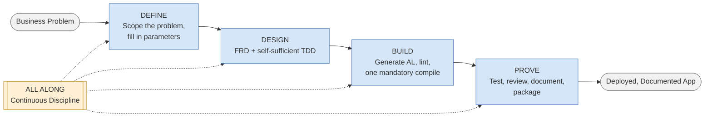
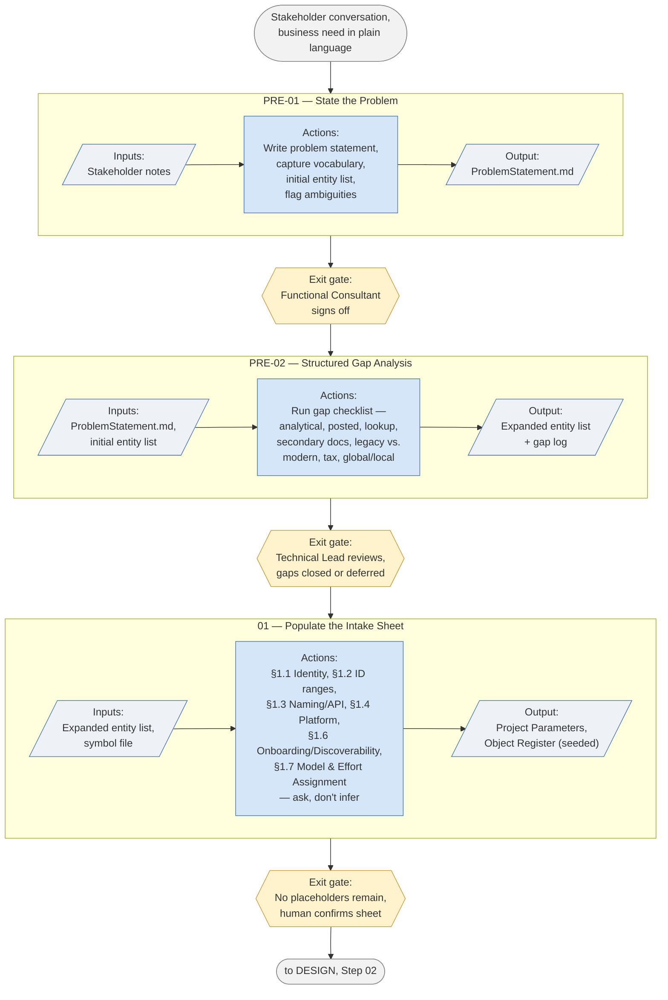
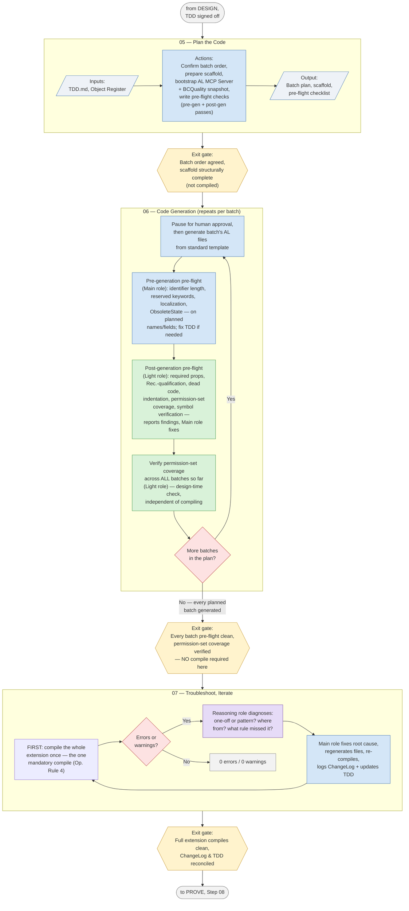
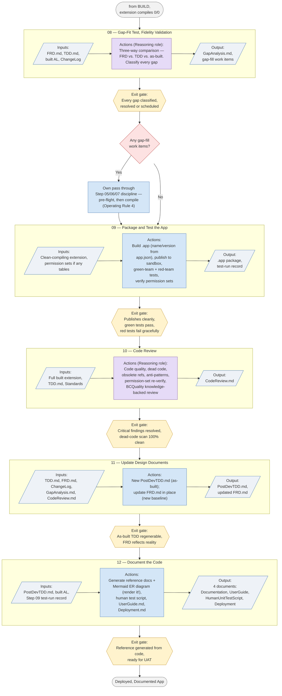

# Agentic Development Framework — Schematics

Visual companion to the runbook (see `CLAUDE.md` for the authoritative text, `RunbookChangelog.md`
for its version history). These diagrams are a reading aid, not a source of truth — if a diagram
and the runbook text ever disagree, the runbook wins and this file is stale and needs updating.

Every diagram below was extracted and rendered through `@mermaid-js/mermaid-cli` before being
committed here, per the same discipline the runbook itself requires at Step 12 ("never ship a
diagram you have not seen render"). Markdown can store a syntactically invalid Mermaid diagram
that looks fine in the source and simply fails to draw wherever it's viewed — that check is what
catches it before a reader does.

**Shape legend, used consistently across every diagram below:**

| Shape | Meaning |
|---|---|
| `(( stadium ))` | Start / end point of a flow |
| `[ rectangle ]` | An action, step, or process |
| `[/ parallelogram /]` | Input or output (data, a document) |
| `{{ hexagon }}` | An exit gate / checkpoint |
| `{ diamond }` | A decision point |
| `[[ subroutine ]]` / dashed box | A cross-cutting concern (ALL ALONG) |

**Color legend** (role diagrams and BUILD only): blue = Main role, green = Light role,
purple = Reasoning role. Where §1.7 role assignment isn't configured, every colored step is done
by the single running model instead.

---

## 1. High-Level Overview

The whole framework in one picture: four phases in sequence, with ALL ALONG's continuous
discipline running underneath every one of them.

---

## 2. Deeper Level — Full Step & Gate Flow

Every step across all four phases, in order, with the exit gate that must be met before the next
one can start (the runbook's own rule: "do not start a step until its predecessor's exit gate is
met").

```mermaid
flowchart TD
    subgraph DEFINE["PHASE: DEFINE"]
        direction TB
        PRE01["PRE-01<br/>State the Problem"] --> G_PRE01{{"Functional Consultant<br/>signs off"}}
        G_PRE01 --> PRE02["PRE-02<br/>Structured Gap Analysis"]
        PRE02 --> G_PRE02{{"Technical Lead reviews,<br/>gaps closed/deferred"}}
        G_PRE02 --> S01["01 — Populate Intake Sheet<br/>(Project Parameters, incl. §1.6/§1.7)"]
        S01 --> G_S01{{"No placeholders,<br/>human confirms sheet"}}
    end

    subgraph DESIGN["PHASE: DESIGN"]
        direction TB
        S02["02 — Craft FRD"] --> G_S02{{"Dev Manager sign-off"}}
        G_S02 --> S03["03 — Craft TDD"]
        S03 --> G_S03{{"Technical Lead sign-off,<br/>self-sufficiency check"}}
        G_S03 --> S04["04 — Sanity Check"]
        S04 --> G_S04{{"0 blocking issues"}}
    end

    subgraph BUILD["PHASE: BUILD"]
        direction TB
        S05["05 — Plan the Code"] --> G_S05{{"Batch order agreed,<br/>scaffold structurally complete"}}
        G_S05 --> S06["06 — Code Generation<br/>(per-batch loop, no compile)"]
        S06 --> G_S06{{"Every batch pre-flight clean,<br/>permission-set coverage verified"}}
        G_S06 --> S07["07 — Troubleshoot, Iterate<br/>(the one mandatory compile)"]
        S07 --> G_S07{{"0 errors / 0 warnings"}}
    end

    subgraph PROVE["PHASE: PROVE"]
        direction TB
        S08["08 — Gap-Fit Test"] --> G_S08{{"Every gap classified,<br/>resolved or scheduled"}}
        G_S08 --> S09["09 — Package and Test"]
        S09 --> G_S09{{"Publishes cleanly,<br/>green/red-team pass"}}
        G_S09 --> S10["10 — Code Review"]
        S10 --> G_S10{{"Critical findings resolved,<br/>dead-code scan clean"}}
        G_S10 --> S11["11 — Update Design Documents"]
        S11 --> G_S11{{"As-built TDD complete,<br/>FRD reflects reality"}}
        G_S11 --> S12["12 — Document the Code"]
        S12 --> G_S12{{"4 docs exist,<br/>ready for UAT"}}
    end

    G_S01 --> S02
    G_S04 --> S05
    G_S07 --> S08

    classDef step fill:#d4e6f7,stroke:#4a7ab5,stroke-width:1px;
    classDef gate fill:#fff3cd,stroke:#c99a3a,stroke-width:1px;
    class PRE01,PRE02,S01,S02,S03,S04,S05,S06,S07,S08,S09,S10,S11,S12 step;
    class G_PRE01,G_PRE02,G_S01,G_S02,G_S03,G_S04,G_S05,G_S06,G_S07,G_S08,G_S09,G_S10,G_S11,G_S12 gate;
```

---

## 3. Phase Schematics

### 3.1 DEFINE

### 3.2 DESIGN

### 3.3 BUILD

The phase most reshaped by this project's own lessons: no per-batch compile, symbol-verified
lint instead, and exactly one mandatory compile once every planned batch exists.

### 3.4 PROVE

---

## 4. Cross-Cutting Schematics

These two aren't tied to a single phase — ALL ALONG runs underneath every phase, and the
Model & Effort Assignment (§1.7) role split, if configured, applies wherever a **Role:** note
appears in the runbook.

### 4.1 ALL ALONG — Continuous Discipline

```mermaid
flowchart LR
    subgraph Phases["The four phases, running in sequence"]
        direction LR
        DEFINE["DEFINE"] --> DESIGN["DESIGN"] --> BUILD["BUILD"] --> PROVE["PROVE"]
    end

    subgraph Continuous["ALL ALONG — every phase, every step"]
        direction TB
        Doc["Document<br/>keep every required doc<br/>current, not retroactively"]
        Change["Track Changes — ChangeLog<br/>every FRD/TDD deviation logged<br/>before the next batch"]
        Retain["Retain Explanations<br/>who decided, and why —<br/>not just the outcome"]
        Test["Testing Feedback Log<br/>verbatim findings, triaged<br/>explicitly, cross-referenced"]
        Mem["Project Memory<br/>docs/ProjectMemory.md —<br/>anchor, not a narrative"]
        Pack["Packaging & Versioning<br/>never delete a package;<br/>propose bumps, don't apply silently"]
        MCP["AL MCP Server<br/>bootstrap once, prefer its<br/>tools over ad hoc terminal use"]
        BCQ["BCQuality Knowledge Snapshot<br/>fetch once, refresh only<br/>on explicit request"]
    end

    Continuous -.-> DEFINE
    Continuous -.-> DESIGN
    Continuous -.-> BUILD
    Continuous -.-> PROVE

    classDef phase fill:#d4e6f7,stroke:#4a7ab5,stroke-width:1px;
    classDef discipline fill:#fdf0d5,stroke:#c99a3a,stroke-width:1px;
    class DEFINE,DESIGN,BUILD,PROVE phase;
    class Doc,Change,Retain,Test,Mem,Pack,MCP,BCQ discipline;
```

### 4.2 Model & Effort Assignment (§1.7)

---

*Generated from `CLAUDE.md` v2.0.1.0 (2026-09-12). If the runbook changes in a way that affects
the phase/step/role structure, regenerate the affected diagram(s) here and re-render before
committing — don't hand-edit a diagram without checking it still parses.*
