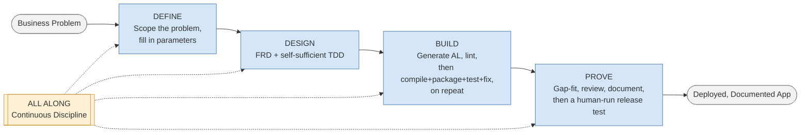
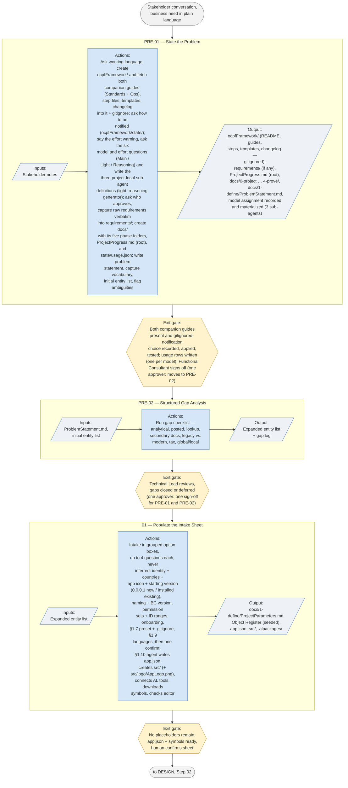
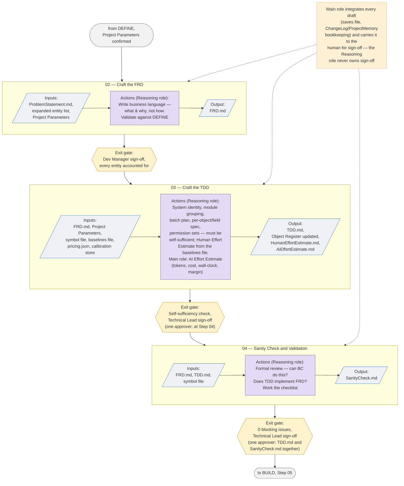
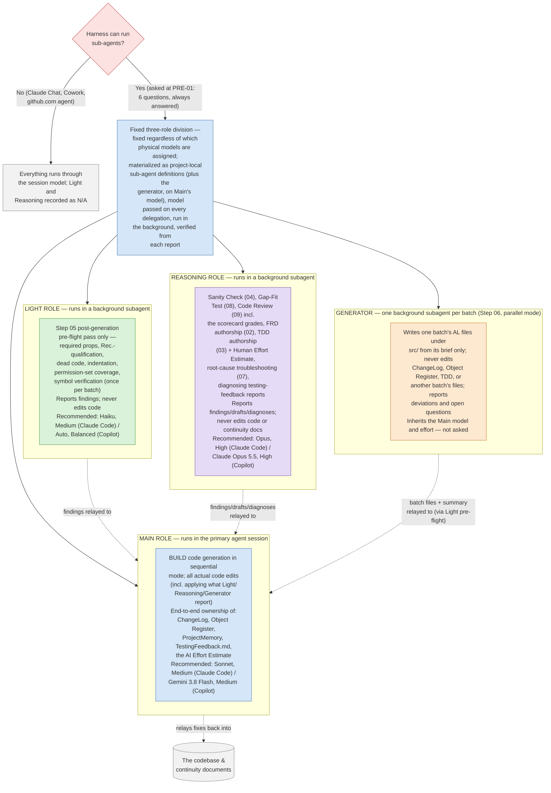

# Agentic Development Framework — Schematics

Visual companion to the runbook (see `BC_App_Build_Routine_Agent.md` and its per-step files in `steps/` for the authoritative text
— a project holds them as `ocpfFramework/runbookSteps/` — `RunbookChangelog.md` for its version history (a project's copy is
`ocpfFramework/RunbookChangelog.md`), and `ocpfFramework/standardsGuide/ocpfALDevStandardsGuide.md` for
the AL rules it cites as **Standards §**). These diagrams are a reading aid, not a source of
truth — if a diagram and the runbook text ever disagree, the runbook wins and this file is stale
and needs updating.

Every diagram below was extracted and rendered through `@mermaid-js/mermaid-cli` before being
committed here, per the same discipline the runbook itself requires at Step 11 ("never ship a
diagram you have not seen render"). Markdown can store a syntactically invalid Mermaid diagram
that looks fine in the source and simply fails to draw wherever it's viewed — that check is what
catches it before a reader does.

**Shape legend, used consistently across every diagram below:**

| Shape | Meaning |
|---|---|
| `(( stadium ))` | Start / end point of a flow |
| `[ rectangle ]` | An action, step, or process |
| `[/ parallelogram /]` | Input or output (data, a document) |
| `{{ hexagon }}` | An exit gate / checkpoint |
| `{ diamond }` | A decision point |
| `[[ subroutine ]]` / dashed box | A cross-cutting concern (ALL ALONG) |

**Color legend** (role diagrams and BUILD only): blue = Main role, green = Light role,
purple = Reasoning role, orange = Generator (a background sub-agent per batch, on the Main model).
Where §1.7 role assignment isn't configured, every colored step is done by the single running
model instead.

---

## 1. High-Level Overview

The whole framework in one picture: four phases in sequence, with ALL ALONG's continuous
discipline running underneath every one of them.

---

## 2. Deeper Level — Full Step & Gate Flow

Every step across all four phases, in order, with the exit gate that must be met before the next
one can start (the runbook's own rule: "do not start a step until its predecessor's exit gate is
met").

```mermaid
flowchart TD
    subgraph DEFINE["PHASE: DEFINE"]
        direction TB
        PRE01["PRE-01<br/>State the Problem<br/>(asks: how to notify you?<br/>who approves?)"] --> G_PRE01{{"Functional Consultant<br/>signs off (one approver:<br/>together with PRE-02)"}}
        G_PRE01 --> PRE02["PRE-02<br/>Structured Gap Analysis"]
        PRE02 --> G_PRE02{{"Technical Lead reviews,<br/>gaps closed/deferred"}}
        G_PRE02 --> S01["01 — Populate Intake Sheet<br/>(Project Parameters, incl. §1.6/§1.7)"]
        S01 --> G_S01{{"No placeholders,<br/>human confirms sheet"}}
    end

    subgraph DESIGN["PHASE: DESIGN"]
        direction TB
        S02["02 — Craft FRD"] --> G_S02{{"Dev Manager sign-off"}}
        G_S02 --> S03["03 — Craft TDD"]
        S03 --> G_S03{{"Self-sufficiency check,<br/>Technical Lead sign-off<br/>(one approver: at Step 04)"}}
        G_S03 --> S04["04 — Sanity Check"]
        S04 --> G_S04{{"0 blocking issues,<br/>Technical Lead sign-off"}}
    end

    subgraph BUILD["PHASE: BUILD"]
        direction TB
        S05["05 — Plan the Code"] --> G_S05{{"Batch plan approved once,<br/>batch mode chosen (parallel /<br/>one at a time / ask per batch),<br/>IDs and src/ paths fixed,<br/>scaffold structurally complete"}}
        G_S05 --> S06["06 — Code Generation<br/>(one background generator per<br/>batch, or a per-batch loop;<br/>no compile)"]
        S06 --> G_S06{{"Every batch pre-flight clean,<br/>incl. permission-set coverage"}}
        G_S06 --> S07["07 — Compile and Package,<br/>Troubleshoot, Iterate<br/>(mandatory compile-and-package,<br/>then a sandbox test/fix/repackage cycle —<br/>every build at a new Revision,<br/>'Package built:' block after each)"]
        S07 --> G_S07{{"0 errors / 0 warnings,<br/>sandbox testing clean"}}
    end

    subgraph PROVE["PHASE: PROVE"]
        direction TB
        S08["08 — Gap-Fit Test<br/>(code-touching gaps loop back<br/>through Step 07's cycle)"] --> G_S08{{"Every gap classified,<br/>resolved or scheduled"}}
        G_S08 --> S09["09 — Code Review<br/>(code-touching fixes also<br/>loop back through Step 07)"]
        S09 --> G_S09{{"Critical findings resolved,<br/>dead-code scan clean"}}
        G_S09 --> S10["10 — Update Design Documents"]
        S10 --> G_S10{{"As-built TDD complete,<br/>FRD reflects reality<br/>(reviewed at the hand-off)"}}
        G_S10 --> S11["11 — Document the Code<br/>(asks: Automated Test Scripts too?<br/>build the release candidate v1.0.0.0 now?)"]
        S11 --> G_S11{{"5 docs exist (+ 1 conditional),<br/>release-candidate question answered,<br/>ready for release testing"}}
        G_S11 --> HandOff2{{"Formal hand-off message —<br/>the framework's own work is done;<br/>one Dev Manager review of<br/>PostDevTDD, FRD, Step 11 docs"}}
        HandOff2 --> S12["12 — Release to Users<br/>for Testing"]
        S12 --> G_S12{{"Dev Manager review done,<br/>upgrade path passes (or first<br/>release), green tests pass,<br/>red tests fail gracefully →<br/>the package that passed ships<br/>to Production as it is"}}
    end

    G_S01 --> S02
    G_S04 --> S05
    G_S07 --> S08

    classDef step fill:#d4e6f7,stroke:#4a7ab5,stroke-width:1px;
    classDef gate fill:#fff3cd,stroke:#c99a3a,stroke-width:1px;
    class PRE01,PRE02,S01,S02,S03,S04,S05,S06,S07,S08,S09,S10,S11,S12 step;
    class G_PRE01,G_PRE02,G_S01,G_S02,G_S03,G_S04,G_S05,G_S06,G_S07,G_S08,G_S09,G_S10,G_S11,G_S12,HandOff2 gate;
```

---

## 3. Phase Schematics

### 3.1 DEFINE

### 3.2 DESIGN

### 3.3 BUILD

The phase most reshaped by this project's own lessons: no per-batch compile, symbol-verified
lint instead, one mandatory compile-and-package once every planned batch exists, then a
continuous sandbox test/fix/repackage cycle rather than a single event.

```mermaid
flowchart TD
    Start(["from DESIGN,<br/>TDD signed off"]) --> S05

    subgraph S05["05 — Plan the Code"]
        direction LR
        In1[/"Inputs:<br/>TDD.md, Object Register"/] --> Act1["Actions:<br/>Confirm batch order; fix every<br/>ID and src/ file path in the<br/>Build Plan; ONE approval, and<br/>the batch mode: all batches in<br/>parallel (recommended) / one at<br/>a time / ask per batch; prepare<br/>scaffold (confirm app.json, src/,<br/>AL tools, symbols; analyzer<br/>settings; pwsh per Ops § Tooling<br/>Checks), fetch BCQuality snapshot<br/>+ OCPF Patterns library,<br/>write pre-flight checks<br/>(pre-gen + post-gen passes)"] --> Out1[/"Output:<br/>Batch plan (IDs + paths fixed),<br/>scaffold, pre-flight checklist"/]
    end
    S05 --> Gate1{{"Exit gate:<br/>Batch order and batch mode<br/>agreed, scaffold<br/>structurally complete<br/>(not compiled)"}}

    Gate1 --> S06

    subgraph S06["06 — Code Generation (per batch — all at once in parallel mode)"]
        direction TB
        B1["Start the batch — in parallel mode<br/>every batch starts now, one<br/>background generator each; pause<br/>first only if the human chose to<br/>be asked per batch"]
        B1 --> PreGen["Pre-generation pre-flight<br/>(Main role): identifier length,<br/>reserved keywords, localization,<br/>ObsoleteState — on planned<br/>names/fields; fix TDD if needed"]
        PreGen --> Gen["Generate the batch's AL files<br/>under src/ from the standard<br/>template — a generator sub-agent<br/>on the Main model in parallel mode,<br/>the Main role otherwise; one file<br/>per Write, one summary per batch"]
        Gen --> PostGen["Post-generation pre-flight<br/>(Light role, in the background as<br/>each batch returns): required props,<br/>file names, Rec.-qualification, dead<br/>code, indentation, permission-set<br/>coverage, symbol verification —<br/>reports findings, Main role fixes"]
        PostGen --> Stop{"Pre-flight failure the TDD<br/>doesn't answer, or a<br/>TDD deviation?"}
        Stop -- "Yes" --> AskHuman["Stop and ask the human;<br/>log any deviation first"]
        AskHuman --> MoreBatches
        Stop -- "No" --> MoreBatches{"More batches<br/>in the plan?"}
        MoreBatches -- "Yes" --> B1
    end
    MoreBatches -- "No — every planned<br/>batch generated" --> Gate2{{"Exit gate:<br/>Every batch pre-flight clean,<br/>incl. permission-set coverage<br/>— NO compile required here"}}

    Gate2 --> S07
    subgraph S07["07 — Compile and Package,<br/>Troubleshoot, Iterate"]
        direction LR
        Compile["FIRST: increment the Revision in<br/>app.json, compile the whole<br/>extension once with the analyzers,<br/>then package it — the one<br/>mandatory compile-and-package<br/>(Op. Rule 4) — and end with the<br/>'Package built:' block"] --> Deploy["Publish package<br/>to BC sandbox"]
        Deploy --> Offer{"Round 1 only — offer an<br/>agent-run API pass. Needs an<br/>HTTP-capable route; the AL MCP<br/>Server is NOT one"}
        Offer -- "No — publish and test<br/>by hand (recommended<br/>default)" --> Test["Human tests by hand:<br/>Postman, Power Automate,<br/>Power Apps, or Copilot Studio"]
        Offer -- "Yes, but no route<br/>turns out to exist" --> NoRoute["Say so plainly, don't<br/>improvise a route —<br/>fall back to testing by hand"]
        Offer -- "Yes, and a route exists" --> APITest["Agent runs the full green/<br/>red-team checklist against the<br/>sandbox API — this round<br/>and every round after"]
        NoRoute --> Test
        Test --> Q{"Errors, warnings,<br/>or issues found?"}
        APITest --> Q
        Q -- "Yes" --> Diag["Check ocpfFramework/patterns/ first, then<br/>reasoning role diagnoses:<br/>one-off or pattern? where<br/>from? what rule missed it?"]
        Diag --> Approve["Human approves the round's<br/>fixes together: apply all /<br/>selected / discuss (a TDD or<br/>design-rule change asked separately)"]
        Approve --> Fix["Main role fixes root cause,<br/>regenerates files, logs<br/>ChangeLog + updates TDD"]
        Fix --> Repackage["Increment the Revision, compile<br/>AND package again (never twice<br/>at one version), 'Package built:'<br/>block"]
        Repackage --> Deploy
        Q -- "No" --> Clean["0 errors / 0 warnings,<br/>sandbox testing clean —<br/>source text stable: draft and<br/>test each language (sync and<br/>checks ran on every build)"]
    end
    Clean --> Gate3

    Gate3{{"Exit gate:<br/>Full extension compiles clean,<br/>human confirms sandbox testing<br/>clean, ChangeLog & TDD reconciled"}}

    Gate3 --> Next(["to PROVE, Step 08"])

    classDef io fill:#eef2f7,stroke:#4a7ab5,stroke-width:1px;
    classDef act fill:#d4e6f7,stroke:#4a7ab5,stroke-width:1px;
    classDef light fill:#d9f2d9,stroke:#4a9b4a,stroke-width:1px;
    classDef reasoning fill:#e6dbf7,stroke:#7d52a8,stroke-width:1px;
    classDef generator fill:#fde8d0,stroke:#c97a2a,stroke-width:1px;
    classDef gate fill:#fff3cd,stroke:#c99a3a,stroke-width:1px;
    classDef endpoint fill:#f2f2f2,stroke:#888,stroke-width:1px;
    classDef decision fill:#fde2e2,stroke:#c0504d,stroke-width:1px;
    class In1,Out1 io;
    class Act1,B1,Fix,Compile,Deploy,Test,Repackage,APITest,NoRoute,AskHuman act;
    class Gen generator;
    class PostGen light;
    class PreGen act;
    class Diag reasoning;
    class Gate1,Gate2,Gate3 gate;
    class Start,Next,Clean endpoint;
    class Approve gate;
    class MoreBatches,Stop,Q,Offer decision;
```

### 3.4 PROVE

Compiling and packaging is already a continuous cycle from Step 07; PROVE adds fidelity checks,
review, and documentation, and closes with a human-run release test against the
`HumanUnitTestScript.md` that Step 11 wrote.

```mermaid
flowchart TD
    Start(["from Step 07,<br/>extension compiles/packages 0/0,<br/>at least one sandbox test done"]) --> S08

    subgraph S08["08 — Gap-Fit Test, Fidelity Validation"]
        direction LR
        In1[/"Inputs:<br/>FRD.md, TDD.md,<br/>built AL, ChangeLog"/] --> Act1["Actions (Reasoning role):<br/>Three-way comparison —<br/>FRD vs. TDD vs. as-built.<br/>Classify every gap"] --> Out1[/"Output:<br/>GapAnalysis.md,<br/>gap-fill work items"/]
    end
    S08 --> GapFill{"Any Oversight gap<br/>needs a code fix?"}
    GapFill -- "Yes" --> GapCycle08["Step 07 cycle again —<br/>fix, compile, package,<br/>redeploy, retest<br/>(Operating Rule 4)"]
    GapCycle08 --> Gate1
    GapFill -- "No (doc-only)" --> Gate1
    Gate1{{"Exit gate:<br/>Every gap classified,<br/>resolved or scheduled,<br/>code fixes recompiled/repackaged"}}

    Gate1 --> S09

    subgraph S09["09 — Code Review"]
        direction LR
        In3[/"Inputs:<br/>Full built extension,<br/>TDD.md, Standards"/] --> Act3["Actions (Reasoning role):<br/>Code quality, dead code,<br/>obsolete refs, anti-patterns,<br/>permission set names,<br/>BCQuality knowledge-backed review;<br/>then grade the §0 Scorecard —<br/>eight dimensions, A–F, overall =<br/>lowest; Main role records"] --> Out3[/"Output:<br/>CodeReview.md<br/>(§0 Scorecard + findings)"/]
    end
    S09 --> ReviewFix{"Any finding<br/>needs a code fix?"}
    ReviewFix -- "Yes" --> GapCycle09["Fixes approved together,<br/>then Step 07 cycle again —<br/>fix, compile, package,<br/>redeploy, retest"]
    GapCycle09 --> Gate3
    ReviewFix -- "No (comment/format only)" --> Gate3
    Gate3{{"Exit gate:<br/>Critical findings resolved,<br/>dead-code scan 100% clean,<br/>code fixes recompiled/repackaged,<br/>scorecard graded, no F unaccepted"}}

    Gate3 --> S10
    subgraph S10["10 — Update Design Documents"]
        direction LR
        In4[/"Inputs:<br/>TDD.md, FRD.md, ChangeLog,<br/>GapAnalysis.md, CodeReview.md"/] --> Act4["Actions:<br/>New PostDevTDD.md (as-built);<br/>update FRD.md in place<br/>(new baseline)"] --> Out4[/"Output:<br/>PostDevTDD.md,<br/>updated FRD.md"/]
    end
    S10 --> Gate4{{"Exit gate:<br/>As-built TDD regenerable,<br/>FRD reflects reality<br/>(one line, then Step 11)"}}

    Gate4 --> S11
    subgraph S11["11 — Document the Code"]
        direction LR
        In5[/"Inputs:<br/>PostDevTDD.md, built AL,<br/>optional Step 07 API test result"/] --> Act5["Actions:<br/>Generate reference docs +<br/>Mermaid ER diagram (render it —<br/>renderer per Ops § Tooling Checks),<br/>human test script (per Step 07's<br/>checklist), UserGuide.md,<br/>Deployment.md, Acknowledgements.md;<br/>ASK: also want Automated Test<br/>Scripts? Then ASK: build the<br/>release candidate v1.0.0.0 now?"] --> Out5[/"Output:<br/>5 docs (Documentation, UserGuide,<br/>HumanUnitTestScript, Deployment,<br/>0-project/Acknowledgements)<br/>+ AutomatedTestScripts.md if yes;<br/>the 1.0.0.0 package on yes"/]
    end
    S11 --> Gate5{{"Exit gate:<br/>Reference generated from code,<br/>Automated Test Scripts and<br/>release-candidate questions<br/>answered, ready for release testing"}}

    Gate5 --> HandOff{{"Formal hand-off message (Rule 6a) —<br/>replaces the generic Rule 6c check-in<br/>for this one boundary; names the one<br/>Dev Manager review (PostDevTDD,<br/>FRD, Step 11 docs):<br/>'Perfect, I understand!' /<br/>'I have some questions'"}}
    HandOff --> S12
    subgraph S12["12 — Release to Users for Testing"]
        direction LR
        In6[/"Inputs:<br/>The release candidate (1.0.0.0, or<br/>the latest 0.x build), HumanUnitTestScript.md,<br/>AutomatedTestScripts.md if any,<br/>UserGuide.md, Deployment.md"/] --> Act6["Actions:<br/>Dev Manager review; upgrade path<br/>tested FIRST if not the first release;<br/>real users run the script by hand on<br/>the sandbox — green + red team,<br/>permission-set verification;<br/>translated docs once that pass<br/>is green, then language passes;<br/>triage findings via Testing<br/>Feedback Log"] --> Out6[/"Output:<br/>ReleaseTestResults.md"/]
    end
    S12 --> ReleaseCheck{"Upgrade path passes (or<br/>first release), all green pass,<br/>all red fail gracefully?"}
    ReleaseCheck -- "No" --> GapCycle12["Step 07 cycle again —<br/>fix, compile, package at 1.0.0.1,<br/>1.0.0.2 …, redeploy; re-run Step<br/>09/10/11 on whatever the fix touched"]
    GapCycle12 --> S12
    ReleaseCheck -- "Yes" --> Gate6

    Gate6{{"Exit gate:<br/>The package that passed ships as it<br/>is — no rename, copy, or bump;<br/>restate the 'Package built:' block<br/>with its Schema Sync Mode; that<br/>package ships to Production; usage<br/>rows + calibration export at close"}}

    Gate6 --> Done(["Deployed, Documented App"])

    classDef io fill:#eef2f7,stroke:#4a7ab5,stroke-width:1px;
    classDef act fill:#d4e6f7,stroke:#4a7ab5,stroke-width:1px;
    classDef reasoning fill:#e6dbf7,stroke:#7d52a8,stroke-width:1px;
    classDef gate fill:#fff3cd,stroke:#c99a3a,stroke-width:1px;
    classDef endpoint fill:#f2f2f2,stroke:#888,stroke-width:1px;
    classDef decision fill:#fde2e2,stroke:#c0504d,stroke-width:1px;
    class In1,Out1,In3,Out3,In4,Out4,In5,Out5,In6,Out6 io;
    class Act4,Act5,Act6,GapCycle08,GapCycle09,GapCycle12 act;
    class Act1,Act3 reasoning;
    class Gate1,Gate3,Gate4,Gate5,Gate6,HandOff gate;
    class Start,Done endpoint;
    class GapFill,ReviewFix,ReleaseCheck decision;
```

---

## 4. Cross-Cutting Schematics

These two aren't tied to a single phase — ALL ALONG runs underneath every phase, and the
Model & Effort Assignment (§1.7) role split applies wherever a **Role:** note
appears in the runbook.

### 4.1 ALL ALONG — Continuous Discipline

```mermaid
flowchart LR
    subgraph Phases["The four phases, running in sequence"]
        direction LR
        DEFINE["DEFINE"] --> DESIGN["DESIGN"] --> BUILD["BUILD"] --> PROVE["PROVE"]
    end

    subgraph Continuous["ALL ALONG — every phase, every step"]
        direction TB
        Doc["Document<br/>keep every required doc<br/>current, not retroactively"]
        Change["Track Changes — ChangeLog<br/>every FRD/TDD deviation logged<br/>before the next batch"]
        Retain["Retain Explanations<br/>who decided, and why —<br/>not just the outcome"]
        Test["Testing Feedback Log<br/>verbatim findings, triaged<br/>explicitly, linked one way from<br/>the ChangeLog/Roadmap"]
        Mem["Project Memory<br/>docs/0-project/ProjectMemory.md —<br/>anchor, not a narrative"]
        Prog["Project Progress Tracker<br/>ProjectProgress.md (project root) —<br/>step table + usage table, created<br/>at PRE-01, both editions"]
        Usage["Usage & Cost Tracking<br/>Op. Rule 11: rows at every step<br/>boundary, one per model, never<br/>hand-written; calibration export<br/>at project close"]
        Pack["Packaging & Versioning<br/>Revision +1 before every build,<br/>never build twice at one version,<br/>never delete a package;<br/>'Package built:' block after each;<br/>Major/Minor/Build bumps proposed"]
        Std["Companion guides<br/>Standards Guide (AL rules, Standards §)<br/>and Operations Guide (procedures, Ops §)<br/>fetched at PRE-01, gitignored"]
        Notif["Notifications<br/>on every turn end, question,<br/>and approval — Claude app, sound,<br/>and/or desktop, chosen at PRE-01,<br/>read every session"]
        MCP["AL MCP Server, Symbols &<br/>Editor Sync — agent sets up at<br/>§1.10, human only approves;<br/>check editor after clean compiles"]
        Ana["Analyzers<br/>CodeCop, UICop, and PerTenantExtensionCop<br/>or AppSourceCop on every<br/>mandatory compile"]
        Hyg["Repository Hygiene<br/>packages, docs/, src/ tracked;<br/>ocpfFramework/state/ and the fetched<br/>folders always gitignored; the rest<br/>of ocpfFramework/ per intake §1.8"]
        Ref["Reference Sources<br/>symbols are the only routine lookup;<br/>MS Learn Base App + System App only<br/>when symbols can't answer, with a<br/>reason; AL Guidelines — online"]
        Tool["Tooling Checks<br/>Node + mermaid via npx (never<br/>which mmdc), PowerShell 7 —<br/>Ops § Tooling Checks, recorded<br/>in framework.json → tooling"]
        Tr["Translations & Terminology<br/>glossary from Microsoft's translations;<br/>agent drafts, named reviewer approves;<br/>release gate: all units signed-off"]
        BCQ["BCQuality Knowledge Snapshot<br/>fetch once, refresh only<br/>on explicit request"]
        Pat["OCPF BC AL Patterns Library<br/>fetch once into ocpfFramework/patterns/,<br/>check before diagnosing from scratch"]
        Plug["OCPF Plugin (optional)<br/>only if ocpfFramework/framework.json exists:<br/>per-session update check (apply on yes,<br/>migrates the layout), Standards fallback,<br/>zero-install AL tools, three sub-agents"]
    end

    Continuous -.-> DEFINE
    Continuous -.-> DESIGN
    Continuous -.-> BUILD
    Continuous -.-> PROVE

    classDef phase fill:#d4e6f7,stroke:#4a7ab5,stroke-width:1px;
    classDef discipline fill:#fdf0d5,stroke:#c99a3a,stroke-width:1px;
    class DEFINE,DESIGN,BUILD,PROVE phase;
    class Doc,Change,Retain,Test,Mem,Prog,Usage,Pack,Std,Notif,MCP,Ana,Hyg,Ref,Tool,Tr,BCQ,Pat,Plug discipline;
```

### 4.2 Model & Effort Assignment (§1.7)

Since v3.4.0.0 the assignment is asked at **PRE-01**, right after notifications — six questions
(model and thinking effort for each of Main, Light, and Reasoning; two boxes in Claude Code, one
page where the harness allows six) — and is **always** filled in: the "No" branch below now only
means a harness that cannot run sub-agents at all. Each role's box carries both halves — model
**and** thinking effort. Since v5.0.0.0 the effort warning is said first (High makes every task
slower), and **the recommended pair is offered first per AI tool**: Claude Code — Main Sonnet
Medium, Light Haiku Medium, Reasoning Opus High; GitHub Copilot — Main Gemini 3.8 Flash Medium,
Light Auto Balanced, Reasoning Claude Opus 5.5 High. A fourth definition, the **generator**, is
written with the other two and inherits the Main model and effort — not asked. **Enforcement**
(Operating Rule 10, Ops § Roles): the answer is materialized as project-local sub-agent definitions
carrying `model:` and `effort:`, every delegation passes the model where the harness allows it and
runs in the background, and every sub-agent report opens with the model it actually ran on — a
mismatch stops the step.

---

*Generated from `BC_App_Build_Routine_Agent.md` v5.0.0.0 (v4.0.0.0 moved the step text into `steps/` and added the usage table and effort estimate; v5.0.0.0 added the batch-mode choice and generator lane in BUILD, the scorecard, the fifth Step 11 document and release-candidate question, the new project paths, and the Usage and Tooling Checks disciplines — the step order and gates are otherwise as drawn); all 8 diagrams re-rendered clean with `@mermaid-js/mermaid-cli` 12.0.0 on September 27, 2026. Version
history is in `RunbookChangelog.md` (a project's copy: `ocpfFramework/RunbookChangelog.md`). If the runbook changes in a way that affects the
phase/step/role structure, regenerate the affected diagram(s) here and re-render before
committing — don't hand-edit a diagram without checking it still parses.*
