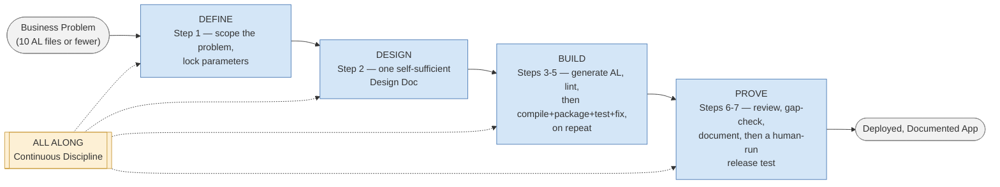
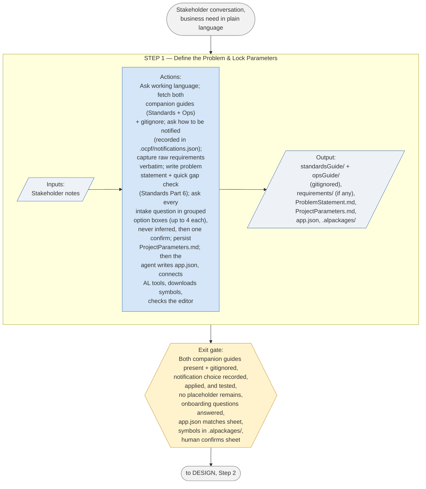
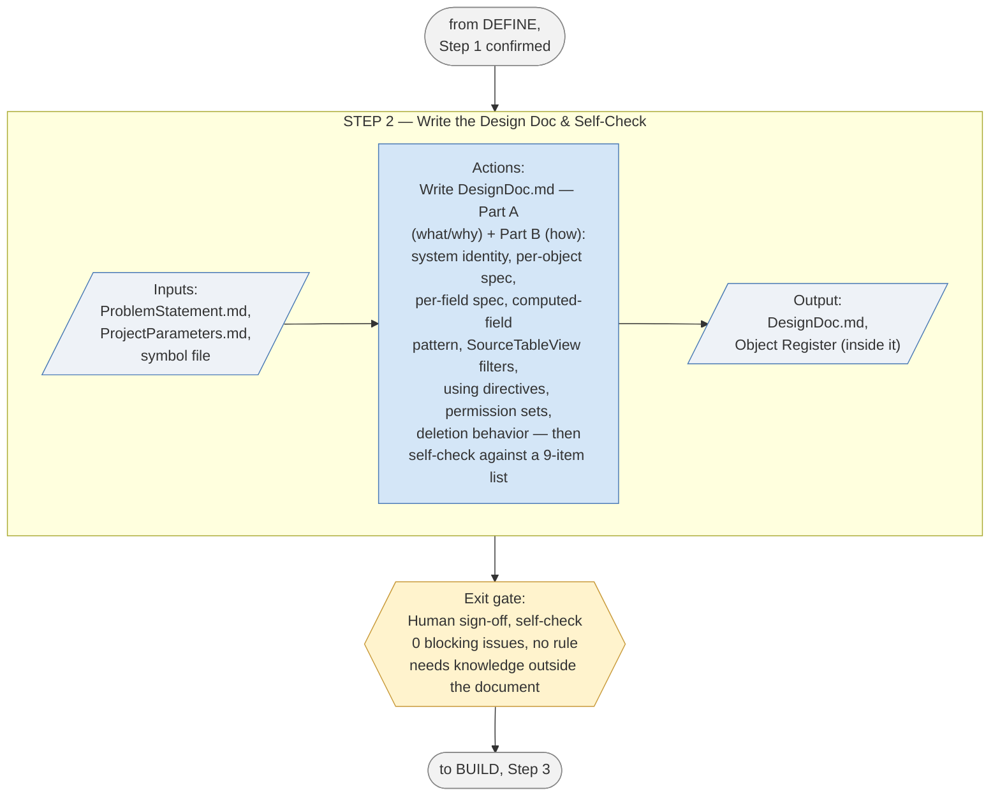
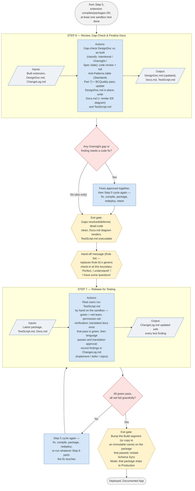

# Agentic Development Framework — Lite Schematics

Visual companion to the Lite runbook (see `LITE_BC_App_Build_Routine_Agent.md` for the
authoritative text, `LITE_RunbookChangeLog.md` for its version history, and
`standardsGuide/ocpfALDevStandardsGuide.md` for the AL rules it cites as **Standards §**, shared
unchanged with the full framework). These diagrams are a reading aid, not a source of truth — if a
diagram and the runbook text ever disagree, the runbook wins and this file is stale and needs
updating.

Every diagram below was extracted and rendered through `@mermaid-js/mermaid-cli` before being
committed here, per the same discipline the runbook itself requires at Step 6 for `Docs.md`'s own
ER diagram ("render it before shipping it"), applied here to every diagram in this file too.
Markdown can store a syntactically invalid Mermaid diagram that looks fine in the source and
simply fails to draw wherever it's viewed — that check is what catches it before a reader does.

**Shape legend, used consistently across every diagram below:**

| Shape | Meaning |
|---|---|
| `(( stadium ))` | Start / end point of a flow |
| `[ rectangle ]` | An action, step, or process |
| `[/ parallelogram /]` | Input or output (data, a document) |
| `{{ hexagon }}` | An exit gate / checkpoint |
| `{ diamond }` | A decision point |
| `[[ subroutine ]]` / dashed box | A cross-cutting concern (ALL ALONG) |

**No color legend here.** The full framework's schematics colors BUILD/PROVE steps by which of
its three optional roles (Main / Light / Reasoning) performs them. Lite has no such split —
Operating Rule set states it plainly: "one model does everything" — so there is no role-color
legend, and no diagram in this file corresponding to the full framework's §4.2 (Model & Effort
Assignment). Every action box below is performed by whichever single model is running the routine.

---

## 1. High-Level Overview

The whole Lite routine in one picture: four phases in sequence, with ALL ALONG's continuous
discipline running underneath every one of them — the same shape as the full framework's overview,
compressed from 14 steps to 7.

---

## 2. Deeper Level — Full Step & Gate Flow

Every step across all four phases, in order, with the exit gate that must be met before the next
one can start (the runbook's own rule: don't start a step until its predecessor's exit gate is
met).

```mermaid
flowchart TD
    subgraph DEFINE["PHASE: DEFINE"]
        direction TB
        S1["Step 1<br/>Define the Problem<br/>& Lock Parameters"] --> G_S1{{"Both companion guides<br/>present + gitignored; notifications<br/>chosen and tested; no placeholder<br/>remains; ProjectParameters.md<br/>+ onboarding Qs answered;<br/>app.json + symbols ready;<br/>human confirms sheet"}}
    end

    subgraph DESIGN["PHASE: DESIGN"]
        direction TB
        S2["Step 2<br/>Design Doc & Self-Check"] --> G_S2{{"Human sign-off;<br/>self-check 0 blocking issues;<br/>no rule needs outside knowledge"}}
    end

    subgraph BUILD["PHASE: BUILD"]
        direction TB
        S3["Step 3<br/>Plan & Scaffold"] --> G_S3{{"Batch plan approved once;<br/>scaffold structurally<br/>complete (not compiled)"}}
        G_S3 --> S4["Step 4<br/>Generate the Code<br/>(per-object loop, no compile)"]
        S4 --> G_S4{{"Every object pre-flight clean;<br/>permission-set coverage verified"}}
        G_S4 --> S5["Step 5<br/>Compile, Package,<br/>Test & Iterate<br/>(mandatory compile-and-package,<br/>then a sandbox test/fix/repackage cycle)"]
        S5 --> G_S5{{"0 errors / 0 warnings;<br/>sandbox testing clean"}}
    end

    subgraph PROVE["PHASE: PROVE"]
        direction TB
        S6["Step 6<br/>Review, Gap-Check<br/>& Finalize Docs"] --> G_S6{{"Gaps resolved/deferred;<br/>dead-code clean; Docs.md<br/>diagram renders; TestScript.md<br/>executable by a non-developer"}}
        G_S6 --> HandOff{{"Formal hand-off message —<br/>replaces the generic Rule 6c<br/>check-in for this boundary"}}
        HandOff --> S7["Step 7<br/>Release for Testing"]
        S7 --> G_S7{{"Green tests pass,<br/>red tests fail gracefully,<br/>translations approved →<br/>same package ships to Production"}}
    end

    G_S1 --> S2
    G_S2 --> S3
    G_S5 --> S6

    classDef step fill:#d4e6f7,stroke:#4a7ab5,stroke-width:1px;
    classDef gate fill:#fff3cd,stroke:#c99a3a,stroke-width:1px;
    class S1,S2,S3,S4,S5,S6,S7 step;
    class G_S1,G_S2,G_S3,G_S4,G_S5,G_S6,G_S7,HandOff gate;
```

---

## 3. Phase Schematics

### 3.1 DEFINE

### 3.2 DESIGN

### 3.3 BUILD

The phase Lite compresses hardest: one batch (two only on a natural split), symbol-verified lint
with no per-object compile, one mandatory compile-and-package once every planned object exists,
then a continuous sandbox test/fix/repackage cycle — the same discipline as the full framework's
BUILD, run by one model instead of three.

```mermaid
flowchart TD
    Start(["from DESIGN,<br/>Design Doc signed off"]) --> S3

    subgraph S3["STEP 3 — Plan & Scaffold"]
        direction LR
        In1[/"Inputs:<br/>DesignDoc.md,<br/>Object Register"/] --> Act1["Actions:<br/>Confirm batch plan (1, or 2 on<br/>a natural split) — the one approval<br/>to generate code; prepare scaffold (confirm<br/>app.json, AL tools, symbols;<br/>analyzer settings),<br/>fetch BCQuality snapshot<br/>+ OCPF Patterns library,<br/>write pre-flight checklist<br/>(pre-gen + post-gen — one model<br/>runs both passes)"] --> Out1[/"Output:<br/>Batch plan, scaffold,<br/>pre-flight checklist"/]
    end
    S3 --> Gate1{{"Exit gate:<br/>Batch plan approved (with 2 batches,<br/>run-through choice recorded),<br/>scaffold structurally complete<br/>(not compiled)"}}

    Gate1 --> S4
    subgraph S4["STEP 4 — Generate the Code (repeats per object)"]
        direction TB
        B1["Next object — no per-object<br/>approval; stop on a pre-flight<br/>failure or Design Doc deviation"]
        B1 --> PreGen["Pre-generation pre-flight:<br/>identifier length, reserved<br/>keywords, localization,<br/>ObsoleteState — on planned<br/>names/fields; fix Design Doc<br/>first if anything fails"]
        PreGen --> Gen["Generate the AL file from<br/>the Standards §1.3 template"]
        Gen --> PostGen["Post-generation pre-flight:<br/>required props, file name,<br/>Rec.-qualification, dead code,<br/>indentation, permission-set<br/>coverage, symbol verification"]
        PostGen --> MoreObjects{"More objects<br/>in the batch plan?"}
        MoreObjects -- "Yes" --> B1
    end
    MoreObjects -- "No — every planned<br/>object generated" --> PermVerify["Verify permission-set coverage<br/>across every table generated —<br/>design-time check, independent<br/>of compiling"]
    PermVerify --> Gate2{{"Exit gate:<br/>Every object pre-flight clean,<br/>permission-set coverage verified<br/>— NO compile required here"}}

    Gate2 --> S5
    subgraph S5["STEP 5 — Compile, Package, Test & Iterate"]
        direction LR
        Compile["FIRST: compile the whole<br/>extension once with the analyzers,<br/>then package it — the one<br/>mandatory compile-and-package<br/>(Op. Rule 4)"] --> Deploy["Publish package<br/>to BC sandbox"]
        Deploy --> Test["Test — by hand (the default:<br/>Postman, Power Automate, Power<br/>Apps, Copilot Studio), or agent-run<br/>if round 1's offer was accepted<br/>AND an HTTP route exists —<br/>the AL MCP Server is not one"]
        Test --> Q{"Errors, warnings,<br/>or issues found?"}
        Q -- "Yes" --> Diag["Check patterns/ first, then:<br/>one-off or pattern? where<br/>from? what rule missed it?"]
        Diag --> Approve["Human approves the round's<br/>fixes together: apply all /<br/>selected / discuss"]
        Approve --> Fix["Fix root cause, regenerate<br/>files, log ChangeLog.md,<br/>update Design Doc"]
        Fix --> Repackage["Compile AND package again<br/>(not just recompile)"]
        Repackage --> Deploy
        Q -- "No" --> Clean["0 errors / 0 warnings,<br/>sandbox testing clean —<br/>source text stable: draft and<br/>test each language"]
    end
    Clean --> Gate3{{"Exit gate:<br/>Full extension compiles clean,<br/>human confirms sandbox testing<br/>clean, no known systemic issue"}}

    Gate3 --> Next(["to PROVE, Step 6"])

    classDef io fill:#eef2f7,stroke:#4a7ab5,stroke-width:1px;
    classDef act fill:#d4e6f7,stroke:#4a7ab5,stroke-width:1px;
    classDef gate fill:#fff3cd,stroke:#c99a3a,stroke-width:1px;
    classDef endpoint fill:#f2f2f2,stroke:#888,stroke-width:1px;
    classDef decision fill:#fde2e2,stroke:#c0504d,stroke-width:1px;
    class In1,Out1 io;
    class Act1,B1,PreGen,Gen,PostGen,PermVerify,Fix,Compile,Deploy,Test,Repackage,Diag act;
    class Gate1,Gate2,Gate3,Approve gate;
    class Start,Next,Clean endpoint;
    class MoreObjects,Q decision;
```

### 3.4 PROVE

Step 6 merges what the full framework splits across four steps (Gap-Fit Test, Code Review, Update
Design Documents, Document the Code) into one review-and-finalize pass; Step 7 is Lite's own
version of the full framework's Step 12 — a human-run release test, with the same formal hand-off
moment marking where the agent's own work ends.

---

## 4. Cross-Cutting Schematics

Not tied to a single phase — ALL ALONG runs underneath every phase, every step, exactly as it does
in the full framework. There is no Lite equivalent of the full framework's §4.2 (Model & Effort
Assignment): Lite drops the Main/Light/Reasoning role split entirely, so there is no role
configuration to diagram.

### 4.1 ALL ALONG — Continuous Discipline

```mermaid
flowchart LR
    subgraph Phases["The four phases, running in sequence"]
        direction LR
        DEFINE["DEFINE"] --> DESIGN["DESIGN"] --> BUILD["BUILD"] --> PROVE["PROVE"]
    end

    subgraph Continuous["ALL ALONG — every phase, every step"]
        direction TB
        Change["ChangeLog.md — the single log<br/>merges ChangeLog + Testing<br/>Feedback + Roadmap into one file"]
        Pack["Packaging & Versioning<br/>never delete a package;<br/>propose bumps, don't apply silently"]
        Std["Companion guides<br/>Standards Guide (Standards §) and<br/>Operations Guide (Ops §) — fetched<br/>at Step 1, gitignored, not optional"]
        Hygiene["Repository Hygiene<br/>standardsGuide/, patterns/,<br/>.alpackages/ always gitignored;<br/>BCQuality outside the project;<br/>packages tracked"]
        Notif["Notifications<br/>on every turn end, question,<br/>and approval — Claude app, sound,<br/>and/or desktop, chosen at Step 1,<br/>read every session"]
        MCP["AL MCP Server, Symbols &<br/>Editor Sync — agent sets up at<br/>Step 1, human only approves;<br/>check editor after clean compiles"]
        Ana["Analyzers<br/>CodeCop, UICop, and PerTenantExtensionCop<br/>or AppSourceCop on every<br/>mandatory compile"]
        Ref["Reference Sources<br/>MS Learn Base App + System App,<br/>translation files, AL Guidelines —<br/>consulted online, not fetched"]
        Tr["Translations & Terminology<br/>glossary in DesignDoc.md;<br/>agent drafts, named reviewer approves;<br/>release gate: all units signed-off"]
        BCQ["BCQuality Knowledge Snapshot<br/>fetch once at Step 3, refresh<br/>only on explicit request"]
        Pat["OCPF BC AL Patterns Library<br/>fetch once into patterns/,<br/>check before diagnosing from scratch"]
        Perm["Permission Sets<br/>Yes the moment 1 table exists;<br/>named with the App Code;<br/>verified at Steps 3 and 4,<br/>proven by PTE0004 at compile"]
        Plug["OCPF Plugin (optional)<br/>only if .ocpf/framework.json exists:<br/>per-session update check (apply on yes),<br/>Standards fallback, zero-install AL tools"]
    end

    Continuous -.-> DEFINE
    Continuous -.-> DESIGN
    Continuous -.-> BUILD
    Continuous -.-> PROVE

    classDef phase fill:#d4e6f7,stroke:#4a7ab5,stroke-width:1px;
    classDef discipline fill:#fdf0d5,stroke:#c99a3a,stroke-width:1px;
    class DEFINE,DESIGN,BUILD,PROVE phase;
    class Change,Pack,Std,Hygiene,Notif,MCP,Ana,Ref,Tr,BCQ,Pat,Perm,Plug discipline;
```

---

*Generated from `LITE_BC_App_Build_Routine_Agent.md` v2.1.0.0; all 7 diagrams re-rendered clean.
Version history is in `LITE_RunbookChangeLog.md`. If the Lite runbook changes in a way that
affects the phase/step structure, regenerate the affected diagram(s) here and re-render before
committing — don't hand-edit a diagram without checking it still parses.*
